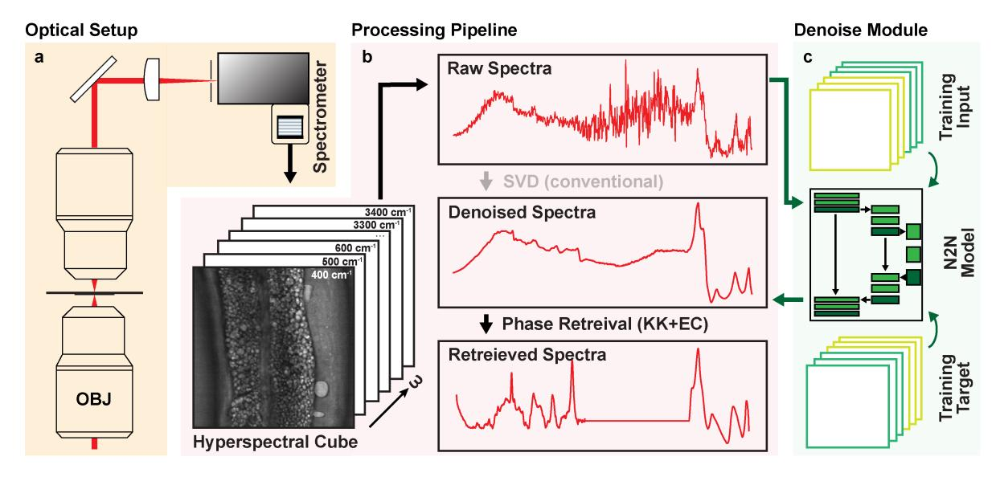
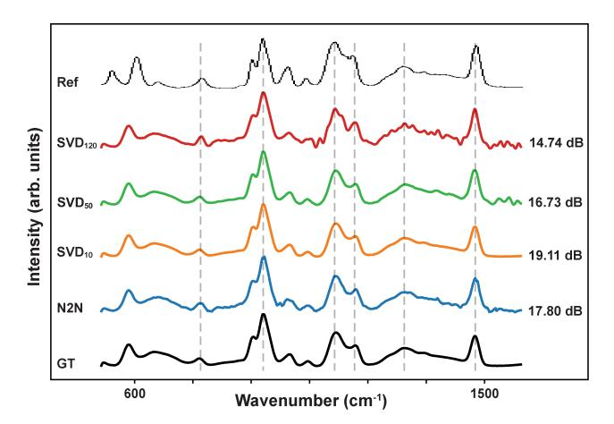
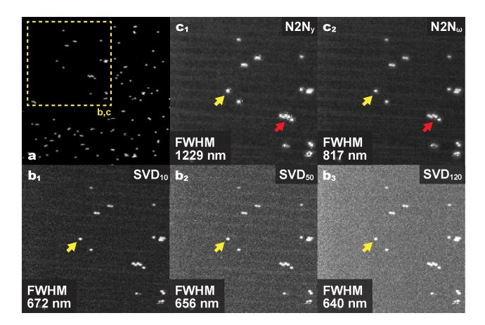
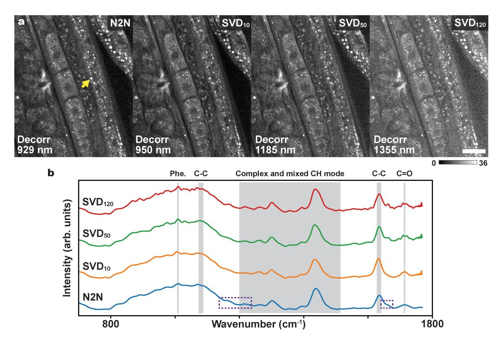
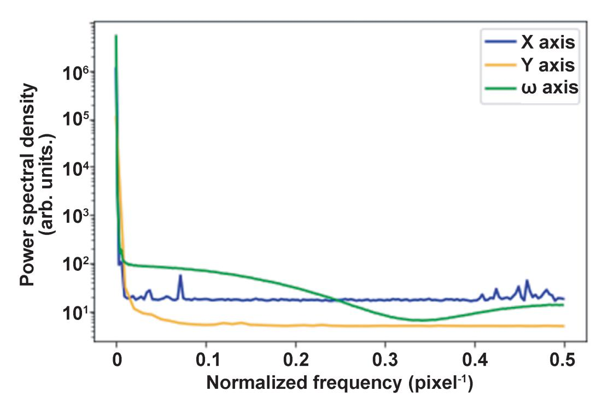
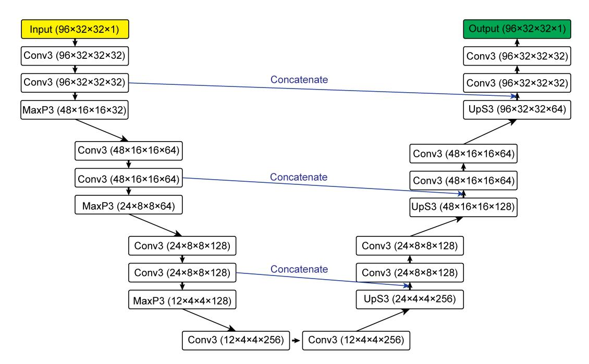
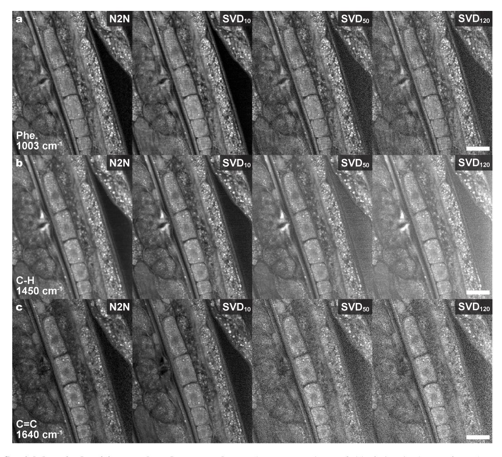

# Denoising Hyperspectral Images from Broadband Coherent Anti-Stokes Raman Scattering Microscopy

# Haoyu Xu Georgia Institute of Technology

hxu419@gatech.edu

# Keyi Han Georgia Institute of Technology

khan300@gatech.edu

### Abstract

*Broadband coherent anti-Stokes Raman scattering (BCARS) microscopy enables rapid, label-free chemical imaging by detecting vibrational signatures of molecular components. However, the technique suffers from low signal-to-noise ratios, particularly in the fingerprint spectral region (400–1800* cm−1 *). The conventional singular value decomposition (SVD) denoising approach requires subjective parameter selection and may discard weak but biochemically relevant spectral features. Here, we present a self-supervised Noise2Noise (N2N) deep learning framework for denoising BCARS hyperspectral images without clean ground truth data or manual threshold tuning. By generating training pairs through axis permutation along dimensions with minimal noise correlation, our method achieves spectral fidelity and spatial resolution comparable to optimally-tuned SVD while preserving weak spectral features that aggressive truncation discards. Validation on glycerol references, microsphere beads, and C. elegans lipid droplets demonstrates robust, automated molecular imaging without specialized expertise.*

## 1. Introduction

Raman spectroscopy and microscopy have emerged as powerful label-free techniques for detecting chemical composition of biological systems. By detecting vibrational signatures of molecular bonds, Raman spectrscopy can identify metabolites, lipids, proteins, and other biomolecules in their native states within intact cells and tissues [\[7,](#page-5-0) [11,](#page-5-1) [27\]](#page-6-0). The fingerprint region (400–1800 cm−1 ) is particularly valuable, as it encodes the majority of chemically specific information. This region contains distinct spectral features that enable discrimination of different biological components and have shown promise for disease detection [\[1,](#page-5-2) [21,](#page-6-1) [22\]](#page-6-2), and cell classification [\[28,](#page-6-3) [32,](#page-6-4) [37\]](#page-7-0). However, exploiting this rich spectral region remains challenging due to inherently weak Raman signals.

While spontaneous Raman imaging provides excellent chemical specificity, acquisition times of hundreds of milliseconds to seconds per pixel limit its practical application to dynamic biological specimens. Broadband coherent anti-Stokes Raman scattering [\[5\]](#page-5-3) (BCARS) microscopy addresses this limitation by acquiring full Raman spectra on millisecond timescales through nonlinear optical interactions. Despite this speed advantage, BCARS suffers from inherently low signal-to-noise ratios, particularly in the fingerprint region where signals are 10-100 times weaker than in the CH-stretch region [\[10\]](#page-5-4). This noise compromises accurate molecular identification and quantitative analysis.

The standard approach for denoising BCARS hyperspectral images relies on singular value decomposition (SVD) based filtering [\[4,](#page-5-5) [19\]](#page-6-5). This method decomposes the hyperspectral data into eigenvectors, with the assumption that signal-bearing components exhibit coherent spatial structures while noise-related components display random patterns. However, SVD-based denoising has notable limitations: the selection of which eigenvectors to retain is subjective and threshold-dependent; weak but biochemically relevant Raman bands may be discarded if they reside in low-amplitude components; and the underlying assumption that noise is random and uncorrelated often fails under real experimental conditions where structured noise from laser fluctuations, detector variability, and other sources can mimic true signal [\[17\]](#page-6-6).

To overcome these limitations, we propose adapting self-supervised deep learning denoising, specifically the Noise2Noise (N2N) framework [\[24\]](#page-6-7), to BCARS hyperspectral imaging. Unlike supervised methods requiring clean ground truth images or SVD approaches requiring subjective parameter selection, N2N learns to denoise from pairs of noisy measurements alone. This approach is particularly well-suited to BCARS because the dense spatio-spectral sampling inherent to point-scanning hyperspectral acquisition provides the redundancy needed to generate training pairs through axis permutation. Our method promises objective, automated denoising that preserves weak biochemically relevant signals while eliminating operator bias.

## 2. Related Work

### 2.1. Denoising Methods for CRI

Noise in coherent Raman imaging arises from multiple sources including camera shot noise, read noise, laser intensity fluctuations and recently characterized photothermal effects that introduce spatially correlated and spectrally varying noise patterns [\[14\]](#page-5-6). This complex noise structure poses significant challenges for conventional denoising approaches [\[17\]](#page-6-6).

Specifically for BCARS hyperspectral data, the predominant denoising method is singular value decomposition (SVD)-based filtering [\[4\]](#page-5-5). SVD is performed by formatting the hyperspectral cube (X, Y, ω) into a 2D rectangular matrix A ∈ RM×N , where M is the spectral dimension containing Raman spectra as a function of wavenumber, and N is the spatial dimension formed by concatenating both X and Y spatial coordinates. The matrix is then decomposed as:

$$\mathbf{A} = \mathbf{U}\mathbf{\Sigma}\mathbf{V}^T \tag{1}$$

where U ∈ RM×M contains orthonormal spectral eigenvectors (left singular vectors), V ∈ R N×N contains orthonormal spatial eigenvectors (right singular vectors), and Σ ∈ RM×N is a diagonal matrix whose entries σ1 ≥ σ2 ≥ · · · ≥ σr ≥ 0 are the singular values arranged in descending order.

The underlying assumption is that signal-bearing components correspond to singular vectors with large singular values exhibiting coherent spatial structure, while noiserelated components correspond to singular vectors with smaller singular values displaying random spatial patterns. Denoising is achieved through truncated SVD reconstruction:

$$\tilde{\mathbf{A}} = \sum_{i=1}^{k} \sigma_i \mathbf{u}_i \mathbf{v}_i^T \tag{2}$$

where k is the number of retained singular components, and ui and vi are the i-th columns of U and V, respectively.

The critical challenge lies in selecting the truncation threshold k: retaining too few components discards weak but biochemically relevant spectral features, while retaining too many preserves noise. In practice, this selection is often performed by visual inspection of the spatial patterns uiv T i corresponding to each eigenvalue σi [\[4\]](#page-5-5), which is a subjective process that introduces operator-dependent variability into the analysis pipeline.

Alternative model-based approaches have been explored for hyperspectral denoising. Principal component analysis combined with wavelet shrinkage can reduce noise in lowenergy components while preserving spectral information [\[8\]](#page-5-7). Total variation regularization incorporates spatial and spectral smoothness constraints [\[25\]](#page-6-8). Despite these innovations, model-based denoisers often struggle in low-SNR environments characteristic of fingerprint BCARS imaging, where deriving appropriate priors becomes intractable [\[14\]](#page-5-6).

Supervised deep learning approaches have shown promise for Raman spectral denoising [\[18,](#page-6-9) [26\]](#page-6-10), but require paired clean-noisy training data that is difficult to obtain for BCARS imaging. This motivates the exploration of selfsupervised approaches that can learn denoising without accessing the ground truth.

### 2.2. Noise2Noise Model

Classical image denoising methods rely on hand-crafted priors, such as total variation [\[31\]](#page-6-11), wavelet shrinkage [\[16\]](#page-6-12), non-local means [\[3\]](#page-5-8), and BM3D [\[12\]](#page-5-9), which leverage image smoothness and self-similarity. Although effective, these approaches struggle to generalize complex or unknown noise distributions. On the other hand, deep learning–based denoisers, such as DnCNN [\[38\]](#page-7-1), significantly advanced the field by learning mappings from noisy to clean images. However, they typically require access to clean ground-truth data, which is often impractical in domains like microscopy or low-light imaging.

To alleviate this dependency, several self-supervised and noise-model-free learning paradigms have been proposed. Noise2Noise [\[24\]](#page-6-7) introduced the key insight that clean targets are not strictly necessary for supervised denoising. Specifically, let x denote the unknown clean image and y the noisy observation:

$$y = x + n \tag{3}$$

where n is the zero mean noise. Traditional supervised denoising trains a network fθ by minimizing the MSE between its prediction and the clean image:

$$\min_{\theta} \mathbb{E}\left[ \left\| f_{\theta}(y) - x \right\|_{2}^{2} \right] \tag{4}$$

Noise2Noise replaces the clean target x with an independent noisy sample y ′ with noise n ′ drawn from the same distribution. Thus, the training objective becomes:

$$\min_{\theta} \mathbb{E}\left[\left\|f_{\theta}(y) - y'\right\|_{2}^{2}\right] = \min_{\theta} \mathbb{E}\left[\left\|f_{\theta}(y) - x\right\|_{2}^{2}\right] + \mathbb{E}\left[\left\|n'\right\|_{2}^{2}\right]$$
(5)

where the cross-term vanishes due to the independence of the noise. Since the last term in Equation [\(5\)](#page-1-0) does not depends on θ, the network implicitly learns to approximate the clean underlying signal. The denoise model can be trained solely on pairs of independent noisy measurements to predict the underlying clean signal.

Subsequent research expanded upon this principle. Noise2Void [\[23\]](#page-6-13) and Noise2Self [\[2\]](#page-5-10) removed the requirement for paired noisy images by relying on blind-spot networks and masking strategies to prevent trivial identity mapping. These methods learn denoising from single noisy images under the assumption of pixelwise independent noise. Noise2Same [\[35\]](#page-7-2) further generalized the

Figure 1. Simplified BCARS setup and processing pipeline. a: BCARS optical setup produces a hyperspectral data cube across Raman shifts. b: Data Processing pipeline. Conventional approaches use singular value decomposition (SVD) followed by Kramers–Kronig (KK) and error correction (EC) for phase retrieval. c: Proposed denoising module replaces SVD by training a Noise2Noise model using permutated noisy raw spectra pairs as training input/output, enabling denoising without the need for subjective singular value selection.

framework to correlated noise and alternative loss formulations. Self2Self [\[30\]](#page-6-14) leveraged dropout-induced redundancy to learn from individual images.

Recent work has further pushed self-supervised denoising into practical microscopy applications beyond generic image benchmarks. Qu et al. introduced SN2N [\[29\]](#page-6-15), a selfinspired Noise2Noise module tailored to live-cell superresolution microscopy. Additionally, Ding et al. proposed SPEND [\[14\]](#page-5-6) (Self-Permutation Noise2Noise Denoiser) to address residual non-independent noise commonly encountered in hyperspectral microscopy. Such self-supervised method offers a silver lining in denoising coherent anti-Stokes Raman scattering, where the underlying denoise statistics is confounding and the ground truth of sample Raman signal is inaccessible.

# 3. Results

The overall goal of the denoise task is to achieve *on par* performance using N2N method with the current golden standard. We characterized our denoising method by denoising phantom targets that demonstrate varied spatiospectral properties. Specifically, the spectral performance was validated with glycerol phantom, which display distinguishable Raman signal features. Meanwhile, the spatial denoising results was showcased by imaging and denoising standard microspheres. Lastly, we applied the denoised method with lipid droplets images in *C. elegans*, demonstrating the adaptability of the proposed methods in a broader biological context.

#### 3.1. Method and Noise Characterization

Our BCARS system acquires hyperspectral data cubes with dimensions (X, Y, ω), where spatial information is obtained through 2D laser scanning (galvo mirror for fast axis, translation stage for slow axis) and spectral information is captured by a spectrometer camera at each spatial position [\[6,](#page-5-11) [15,](#page-6-16) [36\]](#page-7-3), as shown in Fig[.1a](#page-2-0). The resulting data cube contains rich spatio-spectral information but suffers from multiple noise sources that compromise downstream analysis showing in Fig[.1b](#page-2-0).

The dominant noise contributions in our system include camera read noise, photon shot noise and structured noise arising from laser power fluctuations [\[4\]](#page-5-5). We first characterized the noise correlation properties along each axis to determine the optimal permutation direction for selfsupervised denoising. Due to the sequential nature of spatial scanning, adjacent pixels along the fast scanning axis X may exhibit temporal correlation from laser intensity and phase drift. Moreover, the spectral channels for each spatial position are recorded simultaneously by the camera sensor, which leads to statistically non-independent noise across the spectral dimension. We verified this by computing the power spectral density of noise along each axis (showing in [S1\)](#page-9-0), confirming that the slowest axis Y exhibits minimal noise correlation compared to the fast spatial and spectral axes.

Based on this analysis, we selected the slow spatial axis Y as the permutation direction for constructing training pairs. The hyperspectral stack is split into odd and even

Figure 2. Spectral fidelity comparison of denoising methods in the fingerprint region of glycerol. Comparison of retrieved glycerol spectra using SVD-based denoising with varying numbers of retained singular values (10, 50, 120) and N2N denoising. Dashed lines indicate characteristic glycerol Raman peaks. GT: ground truth is obtained by pixel averaging.

spectral frames, which are then recombined in alternating sequences to generate input-target pairs for Noise2Noise training [\[14,](#page-5-6) [24\]](#page-6-7). This approach treats adjacent spectral frames as independent measurements of the same underlying signal, enabling the network to learn noise statistics without requiring ground truth clean images. After training, the network performs inference on the original spectral sequence to produce denoised hyperspectral data cubes (Fig[.1c](#page-2-0)).

Specifically, We adopted the U-Net architecture from [\[34\]](#page-6-17) with four encoder-decoder levels. The model was trained using mean squared error loss with the Adam optimizer for 300 epochs. There are 26224 training patches of size [32 × 32 × 96] were extracted from 6 hyperspectral images, with 90% for training and 10% for validation. The detailed architecture of the model is illustrated in Fig[.S2.](#page-10-0)

#### 3.2. Denoising Glycerol Reference

We evaluated the spectral fidelity of our denoising approach using glycerol in the fingerprint region (500-1500 cm−1 ), which produces intense, sharp Raman peaks that are welldocumented in the literature [\[20\]](#page-6-18). A ground truth (GT) spectrum was obtained by averaging all pixels in the image to suppress noise, providing a reference for quantitative comparison.

Fig[.2](#page-3-0) compares the retrieved spectra from SVD-based denoising with varying numbers of retained singular values (10, 50, 120) against our N2N approach. SVD with aggressive truncation (10 components) achieves the highest SNR (19.11 dB), while retaining more singular values (50, 120) progressively recovers spectral detail but at the cost of reduced SNR (16.73 dB and 14.74 dB, respectively), il-

Figure 3. Denoising microsphere beads. a: 1-µm microsphere beads were deposited on a coverslip and imaged using the BCARS setup. b: Wavenumber-summed projections of the beads after truncated SVD denoising and phase retrieval. The full-width-athalf-maximum (FWHM) of individual beads (yellow arrows) is measured. Under this relatively low-noise condition, retaining a larger number of singular-value components improves reconstruction quality (FWHM = 640 nm for SVD120). c: Bead images after N2N denoising and phase retrieval. Two N2N models trained with different permutation strategies are compared (Y -axis permutation, c1, and ω-axis permutation, c2). Although the ω-axis exhibits higher noise correlation than the y-axis, the oversampling along the spectral dimension mitigates artifacts arising from the under-sampled spatial acquisition.

lustrating the fundamental trade-off in SVD-based methods between noise suppression and signal preservation [\[6\]](#page-5-11). For this strong-signal chemical standard, aggressive truncation performs well since the dominant spectral features are captured within the first few eigenvectors.

Our N2N approach achieves 17.80 dB SNR while maintaining spectral fidelity comparable to the ground truth. Notably, the peak shapes and relative intensities are well preserved without the subjective parameter selection required by SVD. This demonstrates that self-supervised denoising can effectively suppress noise, yielding comparable result to SVD-based denoising.

#### 3.3. Denoising Microsphere Beads

To evaluate spatial denoising performance, we applied N2N method and the SVD-based methods to images of 1-µm fluorescent microsphere beads (Fig[.3\)](#page-3-1). The resulting denoised datasets were sum-projected across all retrieved wavenumbers, and the full-width-at-half-maximum (FWHM) of individual beads (indicated by yellow arrows) was measured to enable direct comparison across methods. As observed previously in the spectral domain, the quality of SVD-based denoising depended strongly on the chosen truncation level (Fig[.3b](#page-3-1)1−3). Retaining a larger number of components (SVD120) yielded bead images with slightly improved res-

Figure 4. Spatial–spectral denoising of a *C. elegans* BCARS dataset. a: Spatial-domain denoising of the ω-projected BCARS data. The N2N method achieves image resolution (Decorr = 929 nm) comparable to the best-performing SVD configuration (SVD10, Decorr = 950 nm). In contrast, retaining too many singular-value components does not adequately denoise the hyperspectral dataset, resulting in degraded image resolution after phase retrieval (Decorr = 1185 nm for SVD50 and 1355 nm for SVD120). Yellow arrow indicates a lipid droplet used for spectral comparison. b: SVD with conservative truncation (SVD120) retains spectral detail but remains visibly noisy. Aggressive truncation (SVD10) suppresses noise but fails to preserve weaker peaks. The N2N approach produces a smooth baseline while preserving fine spectral features (dotted purple box).Scale bar: 25 µm (a). Labeled peaks: Phe (phenylalanine), C-C (carbon-carbon stretching), C=O (carbonyl stretching).

olution. In contrast, using a more aggressive truncation (SVD10) produced harsh denoising effects; structural information encoded in the higher-order components was lost, resulting in blurred beads and a corresponding decrease in apparent resolving power.

N2N method, however, exhibited artifacts around isolated beads (Fig[.3c](#page-3-1)1,2, indicated by red arrows), largely attributable to the choice of permutation axis during model training. When the permutation was performed along a spatial axis (Y -axis), the post-permutation images were effectively under-sampled, leading to a loss of spatial information and causing ring-like artifacts near single beads. Switching the permutation axis to the spectral dimension, where the sampling density is inherently higher, substantially reduced these artifacts, especially in densely packed regions. Compared with the spatial-permutation output, the spectral-permutation approach produced bead images with improved resolution, highlighting the critical role of sampling rate in selecting an appropriate permutation strategy.

#### 3.4. Biological Validation on *C. elegans*

To evaluate denoising performance on biological samples with weaker, more complex spectral signatures, we imaged lipid droplets in *C. elegans*, which provide rich spatio-spectral contrast for label-free interrogation [\[9,](#page-5-12) [33\]](#page-6-19). Unlike homogeneous chemical standards, biological samples present challenges including sample-induced scattering, heterogeneous composition, and inherently lower SNR in the fingerprint region.

First, we validated the performance of the N2N method in the spatial domain. Because ground-truth images of biological samples are inherently unavailable, we employed a parameter-free resolution estimator (Decorr, [\[13\]](#page-5-13)) to quantify the effective spatial resolution of each denoising method. We assessed image quality using wavenumbersum projections (Fig[.4a](#page-4-0)). Consistent with earlier observations, the SVD-based approach exhibited strong truncation dependence. Conversely, when higher-order singular components were retained, SVD denoising became less effective, as reflected by increased Decorr values (SVD120). Aggressive truncation (SVD10) improved resolution by suppressing noise more effectively, indicating that SVD performance in the spatial domain is highly sensitive to the chosen truncation threshold.

On the other hand, the N2N method achieved the best overall performance without requiring manual parameter selection. It provided a favorable balance between noise reduction and information preservation, yielding Decorr results superior to or comparable with all SVD variants. Similar trends were observed for spatial images at 1003 cm−1 , 1450 cm−1 , and 1640 cm−1 , corresponding to Raman signatures of the phenylalanine bonding, C–H stretching, and C=C stretching vibrations, respectively (Fig[.S3\)](#page-11-0). Across these representative spectral channels, N2N consistently produced image quality *on par* with the best-performing SVD condition (SVD10), while eliminating the need for expert-driven decisions such as selecting an optimal number of singular components.

In Fig[.4a](#page-4-0), a lipid droplet is highlighted with a yellow arrow, and the corresponding spectra from this region of interest are compared across denoising methods in Fig[.4b](#page-4-0). SVD with conservative truncation (SVD120 components) retains spectral detail but remains visibly noisy, obscuring weak spectral features. Aggressive truncation (SVD10) effectively suppresses noise but fails to preserve the smaller peaks in the 900-1100 cm−1 and 1640 cm−1 regions. The intermediate setting (SVD50) represents a compromise but still exhibits residual noise and some peak distortion.

In contrast, our N2N approach (Fig[.4b](#page-4-0)) produces a smooth baseline while preserving the fine spectral features across the entire fingerprint region. The smaller peaks and shoulders highlighted in Fig[.4b](#page-4-0) that are lost under aggressive SVD truncation remain clearly resolved, demonstrating the advantage of learning-based denoising for retaining weak but potentially important biochemical information. This is particularly critical for biological samples where relevant molecular signatures may not dominate the spectral variance captured by leading eigenvectors.

### 4. Conclusion

We introduced a self-supervised Noise2Noise denoising framework for BCARS hyperspectral imaging that removes the need for subjective SVD truncation while preserving weak but meaningful Raman features. By exploiting redundancy in the acquisition process and selecting an axis that balance noise correlation and sampling rate, the method learns noise statistics directly from raw data without requiring clean ground truth.

Across chemical standards, microspheres, and C. elegans samples, our approach provides noise suppression and spatial–spectral fidelity comparable to or better than the best SVD settings. These results demonstrate that selfsupervised deep learning offers a robust, automated alternative for denoising BCARS data, paving the way for more reliable and reproducible analysis in low-SNR regimes.

### References

- [1] Halina Abramczyk, Anna Imiela, Beata Brozek-Płuska, ˙ Monika Kopec, Jakub Surmacki, and Agnieszka ´ Sliwi ´ nska. ´ Aberrant protein phosphorylation in cancer by using raman biomarkers. *Cancers*, 11(12), 2019. [1](#page-0-0)
- [2] Joshua Batson and Loic Royer. Noise2self: Blind denoising by self-supervision, 2019. [2](#page-1-1)
- [3] Antoni Buades, Bartomeu Coll, and Jean-Michel Morel. Non-Local means denoising. *Image Process. Line*, 1:208– 212, 2011. [2](#page-1-1)
- [4] Charles H. Camp Jr and Marcus T. Cicerone. Chemically sensitive bioimaging with coherent raman scattering. *Nature Photonics*, 9(5):295–305, 2015. [1,](#page-0-0) [2,](#page-1-1) [3](#page-2-1)
- [5] Charles H. Camp Jr, Young Jong Lee, John M. Heddleston, Christopher M. Hartshorn, WalkerAngela R. Hight, Jeremy N. Rich, Justin D. Lathia, and Marcus T. Cicerone. High-speed coherent raman fingerprint imaging of biological tissues. *Nature Photonics*, 8(8):627–634, 2014. [1](#page-0-0)
- [6] Charles H Camp Jr., Young Jong Lee, and Marcus T Cicerone. Quantitative, comparable coherent anti-Stokes Raman scattering (CARS) spectroscopy: correcting errors in phase retrieval. *Journal of Raman Spectroscopy*, 47(4):408– 415, 2015. [3,](#page-2-1) [4](#page-3-2)
- [7] C. Carlomagno, P. I. Banfi, A. Gualerzi, S. Picciolini, E. Volpato, M. Meloni, A. Lax, E. Colombo, N. Ticozzi, F. Verde, V. Silani, and M. Bedoni. Human salivary raman fingerprint as biomarker for the diagnosis of amyotrophic lateral sclerosis. *Scientific Reports*, 10(1):10175, 2020. [1](#page-0-0)
- [8] Guangyi Chen and Shen-En Qian. Denoising of hyperspectral imagery using principal component analysis and wavelet shrinkage. *IEEE Transactions on Geoscience and Remote Sensing*, 49(3):973–980, 2011. [2](#page-1-1)
- [9] Wei-Wen Chen, George A Lemieux, Charles H Camp, Ta-Chau Chang, Kaveh Ashrafi, and Marcus T Cicerone. Spectroscopic coherent raman imaging of caenorhabditis elegans reveals lipid particle diversity. *Nature Chemical Biology*, 16 (10):1087–1095, 2020. [5](#page-4-1)
- [10] Marcus T Cicerone and Charles H Camp. Histological coherent Raman imaging: a prognostic review. *The Analyst*, 143(1):33–59, 2018. [1](#page-0-0)
- [11] Gabriel Cutshaw, Saji Uthaman, Nora Hassan, Siddhant Kothadiya, Xiaona Wen, and Rizia Bardhan. The emerging role of raman spectroscopy as an omics approach for metabolic profiling and biomarker detection toward precision medicine. *Chemical Reviews*, 123(13):8297–8346, 2023. PMID: 37318957. [1](#page-0-0)
- [12] Kostadin Dabov, Alessandro Foi, Vladimir Katkovnik, and Karen Egiazarian. Image denoising by sparse 3-d transformdomain collaborative filtering. *IEEE Transactions on Image Processing*, 16(8):2080–2095, 2007. [2](#page-1-1)
- [13] A Descloux, K S Grußmayer, and A Radenovic. Parameterfree image resolution estimation based on decorrelation analysis. *Nat. Methods*, 16(9):918–924, 2019. [5](#page-4-1)
- [14] Guangrui Ding, Chang Liu, Jiaze Yin, Xinyan Teng, Yuying Tan, Hongjian He, Haonan Lin, Lei Tian, and Ji-Xin Cheng.

- Self-supervised elimination of non-independent noise in hyperspectral imaging. *Newton*, 1(6):100195, 2025. [2,](#page-1-1) [3,](#page-2-1) [4](#page-3-2)
- [15] Jessica Z. Dixon, Wei-Wen Chen, Haoyu Xu, Xavier Audier, and Marcus T. Cicerone. Broadband coherent anti-stokes raman scattering (bcars) microscopy for rapid, label-free biological imaging. *Review of Scientific Instruments*, 96(4): 043706, 2025. [3](#page-2-1)
- [16] David L Donoho and Iain M Johnstone. Ideal spatial adaptation by wavelet shrinkage. *Biometrika*, 81(3):425–455, 1994. [2](#page-1-1)
- [17] Shiyan Fang, Siyi Wu, Zhou Chen, Chang He, Linley Li Lin, and Jian Ye. Recent progress and applications of raman spectrum denoising algorithms in chemical and biological analyses: A review. *Trends Analyt. Chem.*, 172(117578):117578, 2024. [1,](#page-0-0) [2](#page-1-1)
- [18] Eddie M Gil, Vsevolod Cheburkanov, and Vladislav V Yakovlev. Denoising raman spectra using a single layer convolutional model trained on simulated data. *J. Raman Spectrosc.*, 54(8):814–822, 2023. [2](#page-1-1)
- [19] Per Christian Hansen. The truncatedSVD as a method for regularization. *BIT*, 27(4):534–553, 1987. [1](#page-0-0)
- [20] Jun ichi Kitajima, Toru Ishikawa, Takatomi Tanaka, and Yoshiteru Ida. Water-soluble constitutents of fennel. ix. glucides and nucleosides. *Chemical & Pharmaceutical Bulletin*, 47:988–992, 1999. [4](#page-3-2)
- [21] Reena V. John, Tom Devasia, Mithun N., Jijo Lukose, and Santhosh Chidangil. Micro-raman spectroscopy study of blood samples from myocardial infarction patients. *Lasers in Medical Science*, 37(9):3451–3460, 2022. [1](#page-0-0)
- [22] Kenny Kong, Catherine Kendall, Nicholas Stone, and Ioan Notingher. Raman spectroscopy for medical diagnostics from in-vitro biofluid assays to in-vivo cancer detection. *Advanced Drug Delivery Reviews*, 89:121–134, 2015. Pharmaceutical applications of Raman spectroscopy – from diagnosis to therapeutics. [1](#page-0-0)
- [23] Alexander Krull, Tim-Oliver Buchholz, and Florian Jug. Noise2void - learning denoising from single noisy images, 2019. [2](#page-1-1)
- [24] Jaakko Lehtinen, Jacob Munkberg, Jon Hasselgren, Samuli Laine, Tero Karras, Miika Aittala, and Timo Aila. Noise2Noise: Learning image restoration without clean data. 2018. [1,](#page-0-0) [2,](#page-1-1) [4](#page-3-2)
- [25] Chien-Sheng Liao, Joon Hee Choi, Delong Zhang, Stanley H Chan, and Ji-Xin Cheng. Denoising stimulated raman spectroscopic images by total variation minimization. *J. Phys. Chem. C Nanomater. Interfaces*, 119(33):19397– 19403, 2015. [2](#page-1-1)
- [26] Bryce Manifold, Elena Thomas, Andrew T Francis, Andrew H Hill, and Dan Fu. Denoising of stimulated raman scattering microscopy images via deep learning. *Biomed. Opt. Express*, 10(8):3860–3874, 2019. [2](#page-1-1)
- [27] Carlo F. Morasso, Daisy Sproviero, Maria Chiara Mimmi, Marta Giannini, Stella Gagliardi, Renzo Vanna, Luca Diamanti, Stefano Bernuzzi, Francesca Piccotti, Marta Truffi, Orietta Pansarasa, Fabio Corsi, and Cristina Cereda. Raman spectroscopy reveals biochemical differences in plasma derived extracellular vesicles from sporadic amyotrophic lat-

- eral sclerosis patients. *Nanomedicine: Nanotechnology, Biology and Medicine*, 29:102249, 2020. [1](#page-0-0)
- [28] Nao Nitta, Takanori Iino, Akihiro Isozaki, Mai Yamagishi, Yasutaka Kitahama, Shinya Sakuma, Yuta Suzuki, Hiroshi Tezuka, Minoru Oikawa, Fumihito Arai, Takuya Asai, Dinghuan Deng, Hideya Fukuzawa, Misa Hase, Tomohisa Hasunuma, Takeshi Hayakawa, Kei Hiraki, Kotaro Hiramatsu, Yu Hoshino, Mary Inaba, Yuki Inoue, Takuro Ito, Masataka Kajikawa, Hiroshi Karakawa, Yusuke Kasai, Yuichi Kato, Hirofumi Kobayashi, Cheng Lei, Satoshi Matsusaka, Hideharu Mikami, Atsuhiro Nakagawa, Keiji Numata, Tadataka Ota, Takeichiro Sekiya, Kiyotaka Shiba, Yoshitaka Shirasaki, Nobutake Suzuki, Shunji Tanaka, Shunnosuke Ueno, Hiroshi Watarai, Takashi Yamano, Masayuki Yazawa, Yusuke Yonamine, Dino Di Carlo, Yoichiroh Hosokawa, Sotaro Uemura, Takeaki Sugimura, Yasuyuki Ozeki, and Keisuke Goda. Raman image-activated cell sorting. *Nature Communications*, 11(1):3452, 2020. [1](#page-0-0)
- [29] Liying Qu, Shiqun Zhao, Yuanyuan Huang, Xianxin Ye, Kunhao Wang, Yuzhen Liu, Xianming Liu, Heng Mao, Guangwei Hu, Wei Chen, Changliang Guo, Jiaye He, Jiubin Tan, Haoyu Li, Liangyi Chen, and Weisong Zhao. Selfinspired learning for denoising live-cell super-resolution microscopy. *Nat. Methods*, 21(10):1895–1908, 2024. [3](#page-2-1)
- [30] Yuhui Quan, Mingqin Chen, Tongyao Pang, and Hui Ji. Self2self with dropout: Learning self-supervised denoising from single image. In *Proceedings of the IEEE/CVF Conference on Computer Vision and Pattern Recognition (CVPR)*, 2020. [3](#page-2-1)
- [31] Leonid I Rudin, Stanley Osher, and Emad Fatemi. Nonlinear total variation based noise removal algorithms. *Physica D*, 60(1-4):259–268, 1992. [2](#page-1-1)
- [32] Yuta Suzuki, Koya Kobayashi, Yoshifumi Wakisaka, Dinghuan Deng, Shunji Tanaka, Chun-Jung Huang, Cheng Lei, Chia-Wei Sun, Hanqin Liu, Yasuhiro Fujiwaki, Sangwook Lee, Akihiro Isozaki, Yusuke Kasai, Takeshi Hayakawa, Shinya Sakuma, Fumihito Arai, Kenichi Koizumi, Hiroshi Tezuka, Mary Inaba, Kei Hiraki, Takuro Ito, Misa Hase, Satoshi Matsusaka, Kiyotaka Shiba, Kanako Suga, Masako Nishikawa, Masahiro Jona, Yutaka Yatomi, Yaxiaer Yalikun, Yo Tanaka, Takeaki Sugimura, Nao Nitta, Keisuke Goda, and Yasuyuki Ozeki. Label-free chemical imaging flow cytometry by high-speed multicolor stimulated raman scattering. *Proceedings of the National Academy of Sciences*, 116(32):15842–15848, 2019. [1](#page-0-0)
- [33] Tracy L. Vrablik, Vladislav A. Petyuk, Emily M. Larson, Richard D. Smith, and Jennifer L. Watts. Lipidomic and proteomic analysis of Caenorhabditis elegans lipid droplets and identification of ACS-4 as a lipid droplet-associated protein. *Biochimica et Biophysica Acta - Molecular and Cell Biology of Lipids*, 2015. [5](#page-4-1)
- [34] Martin Weigert, Uwe Schmidt, Tobias Boothe, Andreas Muller, Alexandr Dibrov, Akanksha Jain, Benjamin Wil- ¨ helm, Deborah Schmidt, Coleman Broaddus, Sian Culley, ˆ Mauricio Rocha-Martins, Fabian Segovia-Miranda, Caren ´ Norden, Ricardo Henriques, Marino Zerial, Michele Solimena, Jochen Rink, Pavel Tomancak, Loic Royer, Florian Jug, and Eugene W Myers. Content-aware image restora-

- tion: pushing the limits of fluorescence microscopy. *Nat. Methods*, 15(12):1090–1097, 2018. [4](#page-3-2)
- [35] Yaochen Xie, Zhengyang Wang, and Shuiwang Ji. Noise2same: Optimizing a self-supervised bound for image denoising, 2020. [2](#page-1-1)
- [36] Haoyu Xu, Wei-Wen Chen, Jessica Z Dixon, Davendra S Maharaj, Karthikeya M Sharma, Xavier Audier, and Marcus T Cicerone. Ultra-high information-content chemical imaging with broadband coherent anti-stokes raman and two-photon fluorescence lifetime microscopy. *J. Vis. Exp.*, (224), 2025. [3](#page-2-1)
- [37] Jessica Zahn, Arno Germond, Alice Y. Lundgren, and Marcus T. Cicerone. Discriminating cell line specific features of antibiotic-resistant strains of escherichia coli from raman spectra via machine learning analysis. *Journal of Biophotonics*, 15(7):e202100274, 2022. [1](#page-0-0)
- [38] Kai Zhang, Wangmeng Zuo, Yunjin Chen, Deyu Meng, and Lei Zhang. Beyond a gaussian denoiser: Residual learning of deep cnn for image denoising. *IEEE Transactions on Image Processing*, 26(7):3142–3155, 2017. [2](#page-1-1)

# Denoising Hyperspectral Images from Broadband Coherent Anti-Stokes Raman Scattering Microscopy

Supplementary Material

Figure S1. Noise Power Spectral Density analysis determines permutation axis. Noise PSD analysis along three acquisition axes: X-axis (fast galvo scanning, blue), Y -axis (slow linear stage, green), and ω-axis (spectral tuning, orange). The y-axis exhibits the lowest PSD values across spatial frequencies, indicating minimal noise correlation along this dimension. This makes the Y -axis the optimal permutation axis for SPEND training, as it provides the most independent measurements required for effective Noise2Noise learning. The shaded regions represent variance across measurements.

Figure S2. U-net architecture trained for our method. The network consists of a 4-layer encoder-decoder architecture with skip connections. The encoder path (left) uses 3D-convolutional layers and max-pooling operations to progressively downsample and extract hierarchical features. The decoder path (right) employs upsampling layers and concatenates features from corresponding encoder levels via skip connections (arrows) to recover spatial resolution while preserving fine-grained details. The architecture dimensions are shown for each layer. This U-Net processes permuted noisy hyperspectral image stacks to produce denoised outputs.

Figure S3. Spatial-domain denoising at selected wavenumbers. The same *C. elegans* field of view is shown after N2N and truncated SVD denoising at 1003 cm−1 (a, Phe.), 1450 cm−1 (b, C–H), and 1640 cm−1 (c, C=C). N2N achieves performance on par with the best SVD setting (SVD10), demonstrating strong generality across hyperspectral data.