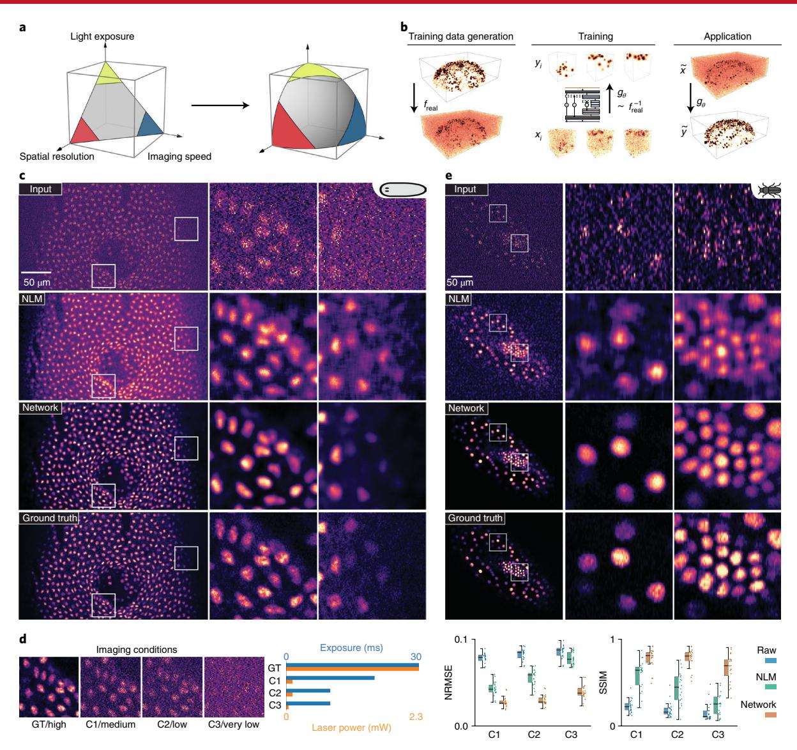
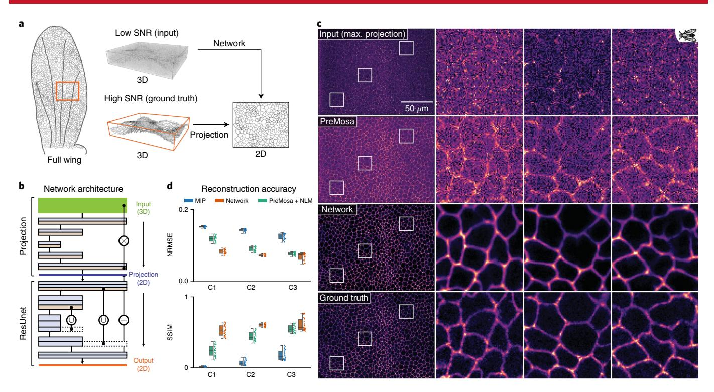
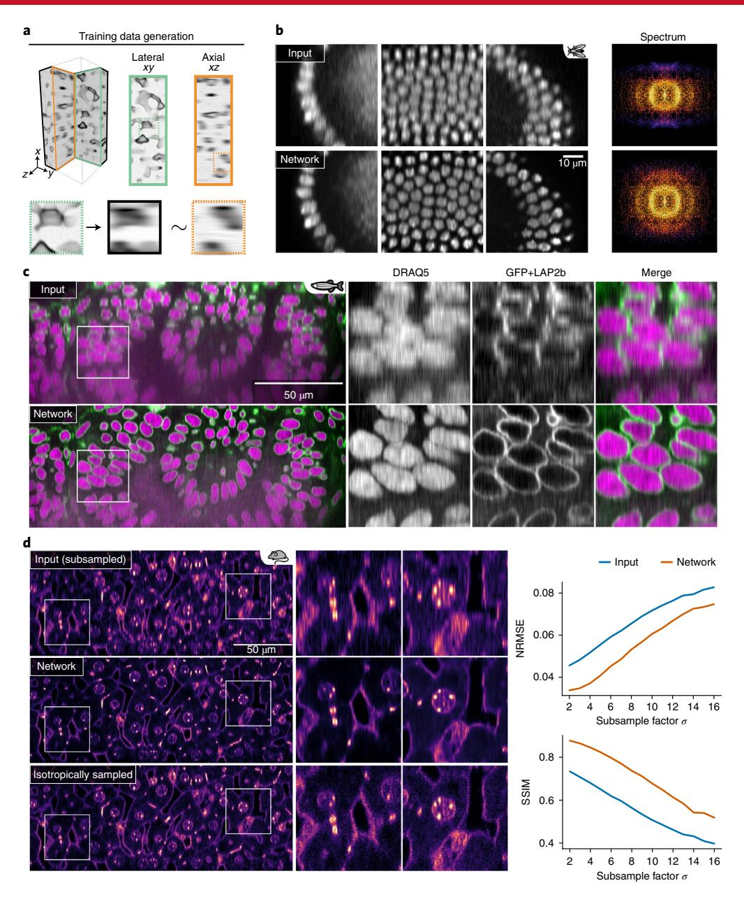
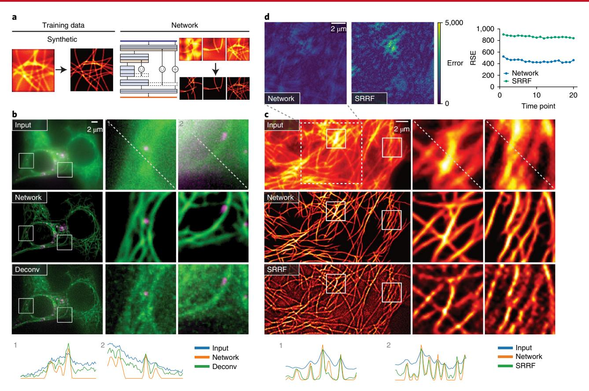
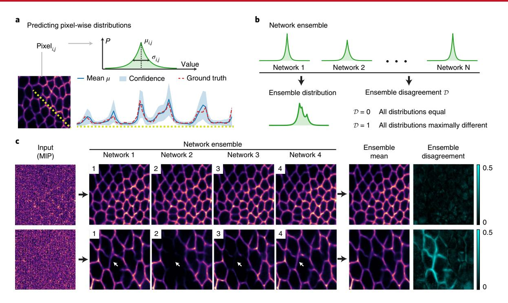

# Content-aware image restoration: pushing the limits of fluorescence microscopy

Martin Weigert 1,2\*, Uwe Schmidt 1,2, Tobias Boothe 1,2, Andreas Müller 3,4,5, Alexandr Dibrov 1,2, Akanksha Jain 2, Benjamin Wilhelm 1,6, Deborah Schmidt 1, Coleman Broaddus 1,2, Siân Culley 7,8, Mauricio Rocha-Martins 1,2, Fabián Segovia-Miranda 2, Caren Norden 2, Ricardo Henriques 7,8, Marino Zerial 2, Michele Solimena 2,3,4,5, Jochen Rink 2, Pavel Tomancak 2, Loic Royer 1,2,9\*, Florian Jug 1,2\* and Eugene W. Myers 1,2,10

Fluorescence microscopy is a key driver of discoveries in the life sciences, with observable phenomena being limited by the optics of the microscope, the chemistry of the fluorophores, and the maximum photon exposure tolerated by the sample. These limits necessitate trade-offs between imaging speed, spatial resolution, light exposure, and imaging depth. In this work we show how content-aware image restoration based on deep learning extends the range of biological phenomena observable by microscopy. We demonstrate on eight concrete examples how microscopy images can be restored even if 60-fold fewer photons are used during acquisition, how near isotropic resolution can be achieved with up to tenfold under-sampling along the axial direction, and how tubular and granular structures smaller than the diffraction limit can be resolved at 20-times-higher frame rates compared to state-of-the-art methods. All developed image restoration methods are freely available as open source software in Python, FIJI, and KNIME.

luorescence microscopy is an indispensable tool in the life sciences for investigating the spatio-temporal dynamics of cells, tissues, and developing organisms. Recent advances such as light-sheet microscopy1-3, structured illumination microscopy4,5, and super-resolution microscopy6-8 enable time-resolved volumetric imaging of biological processes within cells at high resolution. The quality at which these processes can be faithfully recorded, however, is determined not only by the spatial resolution of the optical device used, but also by the desired temporal resolution, the total duration of an experiment, the required imaging depth, the achievable fluorophore density, bleaching, and photo-toxicity9,10. These aspects cannot all be optimized at the same time—trade-offs must be made, for example, by sacrificing signal-to-noise ratio (SNR) by reducing exposure time to gain imaging speed. Such trade-offs are often depicted by a design space that has resolution, speed, light exposure, and imaging depth as its dimensions (Fig. 1a), with the volume being limited by the maximal photon budget compatible with sample health11,12.

These trade-offs can be addressed through optimization of the microscopy hardware, yet there are physical limits that cannot easily be overcome. Therefore, computational procedures to improve the quality of acquired microscopy images are becoming increasingly important. Super-resolution microscopy4,13-16, deconvolution17-19, surface projection algorithms20,21, and denoising methods22-24 are examples of sophisticated image restoration algorithms that can push the limit of the design space, and thus allow the recovery of important biological information that would be inaccessible by imaging alone. However, most common image restoration problems

have multiple possible solutions, and require additional assumptions to select one solution as the final restoration. These assumptions are typically general, for example, requiring a certain level of smoothness of the restored image, and therefore are not dependent on the specific content of the images to be restored. Intuitively, a method that leverages available knowledge about the data at hand ought to yield superior restoration results.

Deep learning is such a method, because it can learn to perform complex tasks on specific data by employing multilayered artificial neural networks trained on a large body of adequately annotated example data25,26. In biology, deep learning methods have, for instance, been applied to the automatic extraction of connectomes from large electron microscopy data27, for classification of image-based high-content screens28, fluorescence signal prediction from label-free images29,30, resolution enhancement in histopathology31, or for single-molecule localization in super-resolution microscopy32,33. However, the direct application of deep learning methods to image restoration tasks in fluorescence microscopy is complicated by the absence of adequate training data and the fact that it is impossible to generate them manually.

We present a solution to the problem of missing training data for deep learning in fluorescence microscopy by developing strategies to generate such data. This enables us to apply common convolutional neural network architectures (U-Nets34) to image restoration tasks, such as image denoising, surface projection, recovery of isotropic resolution, and the restoration of sub-diffraction structures. We show, in a variety of imaging scenarios, that trained

¹Center for Systems Biology Dresden, Dresden, Germany. ²Max Planck Institute of Molecular Cell Biology and Genetics, Dresden, Germany. ³Molecular Diabetology, University Hospital and Faculty of Medicine Carl Gustav Carus, TU Dresden, Dresden, Germany. ⁴Paul Langerhans Institute Dresden of the Helmholtz Center Munich at the University Hospital Carl Gustav Carus and Faculty of Medicine of the TU Dresden, Dresden, Germany. ⁵German Center for Diabetes Research (DZD e.V.), Neuherberg, Germany. ⁶University of Konstanz, Konstanz, Germany. ³MRC Laboratory for Molecular Cell Biology, University College London, London, UK. ®The Francis Crick Institute, London, UK. °CZ Biohub, San Francisco, CA, USA. ¹⁰Department of Computer Science, Technical University Dresden, Dresden, Germany. \*e-mail: mweigert@mpi-cbg.de; loic.royer@czbiohub.org; jug@mpi-cbg.de

NATURE METHODS ARTICLES

**Fig. 1 | CARE. a**, Trade-offs between imaging speed, spatial resolution, and light exposure need to be made owing to the constraints of the maximal photon budget a sample permits. Image restoration enlarges this design space. **b**, Overview of the proposed pipeline for image denoising. Pairs  $(x_i, y_i)$  of registered high- and low-SNR volumes are acquired at the microscope. A convolutional neural network is trained to restore  $y_i$  from  $x_i$ . The trained CARE network can then be applied to previously unseen low-SNR images  $\tilde{x}$ , yielding  $\tilde{y}$ . **c**, Input data and restorations for nucleus-stained (RedDot1) flatworm (*S. mediterranea*). Shown are a single image-plane of a raw input stack (top row), the output of NLM denoising22 (second row), the network prediction (third row), and the high-SNR gold standard/ground truth (bottom row). **d**, Prediction error for data from **c** at three imaging conditions C1-C3. Box-dot plots (n=20 per condition) show NRMSE and SSIM (higher is better) for the input, for the denoising baseline (NLM), and for network restorations. Boxes show interquartile range (IQR), lines signify medians, and whiskers extend to 1.5 times the IQR. **e**, Input data and restorations for a nucleus-labeled (EFA::nGFP) red flour beetle (*Tribolium castaneum*) embryo. Figure structure as in **c**.

content-aware image restoration (CARE) networks produce results that were previously unobtainable. This means that the application of CARE to biological images transcends the limitations of the design space (Fig. 1a), pushing the limits of the possible in fluorescence microscopy through machine-learned image computation.

#### Results

Images with a low SNR are difficult to analyze in fluorescence microscopy. One way to improve SNR is to increase laser power or exposure times, which is usually detrimental to the sample, limiting the possible duration of the recording and introducing artifacts due to photodamage. An alternative solution is to image at low SNR, and later to computationally restore acquired images. Classical approaches, such as non-local-means denoising22, can in principle achieve this, but without leveraging available knowledge about the data at hand.

Image restoration with physically acquired training data. To demonstrate the power of machine learning in biology, we developed CARE. We first demonstrate the utility of CARE on microscopy acquisitions of the flatworm *Schmidtea mediterranea*, a model organism for studying tissue regeneration. This organism is exceptionally sensitive to even moderate amounts of laser light35, exhibiting muscle flinching at desirable illumination levels even when anesthetized (Supplementary Video 1). Using a laser power that reduces flinching to an acceptable level results in images with such low SNR that they are impossible to interpret directly. Consequently, live imaging of *S. mediterranea* has thus far been intractable.

To address this problem with CARE, we imaged fixed worm samples at several laser intensities. We acquired well-registered pairs of images, a low-SNR image at laser power compatible with live Articles **NATurE METhods**

imaging, and a high-SNR image, serving as a ground truth (Fig. [1b](#page-1-0)). We then trained a convolutional neural network and applied the trained network to previously unseen live-imaging data of *S. mediterranea* (Supplementary Notes 1 and 2). We used networks of moderate size (∼106 parameters) based on the U-Net architecture[34](#page-7-22)[,36,](#page-7-24) together with a per-pixel similarity loss, for example absolute error (Supplementary Fig. 1, Supplementary Note 2, and Supplementary Table 3). We consistently obtained high-quality restorations, even if the SNR of the images was very low, for example, being acquired with a 60-fold reduced light dosage (Fig. [1c,d,](#page-1-0) Supplementary Video 2, and Supplementary Figs. 2–4). To quantify this observation, we measured the restoration error between prediction and groundtruth images for three different exposure and laser-power conditions. Both the normalized root-mean-square error (NRMSE) and the structural similarity index (SSIM; a measurement of the perceived similarity between two images[37](#page-7-25)) improved considerably compared with results obtained by several potent classical denoising methods (Fig. [1d,](#page-1-0) Supplementary Figs. 3 and 5, and Supplementary Table 1). We further observed that even a small number of training images (for example, 200 patches of size 64×64×16) led to an acceptable image restoration quality (Supplementary Fig. 6). Moreover, while training a CARE network can take several hours, the restoration time for a volume of size 1,024×1,024×100 was less than 20 s on a single graphics processing unit. (We used a common consumer graphics processing unit (Nvidia GeForce GTX 1080 or Titan X) for all presented experiments.) In this case, CARE networks are able to take input data that are unusable for biological investigations and turn them into high-quality timelapse data, providing a practical framework for live-cell imaging of *S. mediterranea*.

We next asked whether CARE improves common downstream analysis tasks in live-cell imaging, such as nuclei segmentation. We used confocal microscopy recordings of developing *Tribolium castaneum* (red flour beetle) embryos, and as before trained a network on image pairs of samples acquired at high and low laser powers (Fig. [1e](#page-1-0)). The resulting CARE network performed well even on extremely noisy, previously unseen live-imaging data (Supplementary Note 4, Supplementary Video 3, and Supplementary Fig. 7). To test the benefits of CARE for segmentation, we applied a simple nuclei segmentation pipeline to raw and restored image stacks of *T. castaneum*. The results show that, compared to manual expert segmentation, the segmentation accuracy (as measured with the standard SEG score[38](#page-7-26)) improved from SEG=0.47 on the classically denoised raw stacks to SEG=0.65 on the CARE restored volumes (Supplementary Fig. 8). Since this segmentation performance is achieved at substantially reduced laser power, the gained photon budget can now be spent on the imaging speed and light-exposure dimensions of the design space. This means that *Tribolium* embryos, when restored with CARE, can be imaged for longer and at higher frame rates, thus enabling improved tracking of cell lineages.

Encouraged by the performance of CARE on two independent denoising tasks, we asked whether such networks can also solve more complex, composite tasks. In biology it is often useful to image a three-dimensional (3D) volume and project it to a two-dimensional (2D) surface for analysis, such as when studying cell behavior in developing epithelia of the fruit fly *Drosophila melanogaster*[39](#page-7-27)[,40.](#page-7-28) Also, in this context, it is beneficial to optimize the trade-off between laser power and imaging speed, usually resulting in rather low-SNR images. Thus, this restoration problem is composed of projection and denoising, presenting the opportunity to test whether CARE networks can deal with such composite tasks. For training, we again acquired pairs of low- and high-SNR 3D image stacks, and further generated 2D projection images from the high-SNR stack[s20](#page-7-9) that serve as ground truth (Fig. [2a](#page-3-0)). We developed a task-specific network architecture that consists of two jointly trained parts: a network for surface projection, followed by a network for image denoising (Fig. [2b](#page-3-0), Supplementary Fig. 9, and Supplementary Note 2). The results show that with CARE, reducing light dosage up to tenfold has virtually no adverse effect on the quality of segmentation and tracking results obtained on the projected 2D images with an established analysis pipelin[e41](#page-7-29) (Fig. [2c,d](#page-3-0), Supplementary Video 4, and Supplementary Figs. 10–12). Even for this complex task, the gained photon budget can be used to move beyond the design space, for example, by increasing temporal resolution, and consequently improving the precision of tracking of cell behaviors during wing morphogenesi[s41.](#page-7-29)

**Image restoration with semi-synthetic training data.** A common problem in fluorescence microscopy is that the axial resolution of volumetric acquisitions is substantially lower than the lateral resolution (some advanced modalities allow for isotropic acquisitions, such as multiview light-sheet microscop[y19,](#page-7-8)[42](#page-7-30)). This anisotropy compromises the ability to accurately measure properties such as the shapes or volumes of cells. Anisotropy is caused by the inherent axial elongation of the optical point spread function (PSF), and the often low axial sampling rate of volumetric acquisitions required for fast imaging. For the restoration of isotropic image resolution, adequate pairs of training data cannot directly be acquired at the microscope. Rather, we took well-resolved lateral slices as ground truth, and computationally modified them (applying a realistic imaging model; Supplementary Note 2) to resemble anisotropic axial slices of the same image stack. In this way, we generated matching pairs of images showing the same content at axial and lateral resolutions. These semi-synthetically generated pairs are suitable to train a CARE network that then restores previously unseen axial slices to nearly isotropic resolution (Fig. [3a,](#page-4-0) Supplementary Fig. 13, Supplementary Note 2, and refs [43,](#page-7-31)[44](#page-7-32)). To restore entire anisotropic volumes, we applied the trained network to all lateral image slices, taken in two orthogonal directions, averaged to a single isotropic restoration (Supplementary Note 2).

We applied this strategy to increase axial resolution of acquired volumes of fruit fly embryos[45](#page-7-33), zebrafish retin[a46](#page-7-34), and mouse liver, imaged with different fluorescence imaging techniques. The results show that CARE improved the axial resolution in all three cases considerably (Fig. [3b–d,](#page-4-0) Supplementary Videos 5 and 6, and Supplementary Figs. 14 and 15). To quantify this, we performed Fourier spectrum analysis of *Drosophila* volumes before and after restoration, and showed that the frequencies along the axial dimension are fully restored, while frequencies along the lateral dimensions remain unchanged (Fig. [3b](#page-4-0) and Supplementary Fig. 16). Since the purpose of the fruit fly data is to segment and track nuclei, we applied a common segmentation pipelin[e47](#page-7-35) to the raw and restored images, and observed that the fraction of incorrectly identified nuclei was reduced from 1.7% to 0.2% (Supplementary Note 2 and Supplementary Figs. 17 and 18). Thus, restoring anisotropic volumetric embryo images to effectively isotropic stacks leads to improved segmentation, and will enable more reliable extraction of developmental lineages.

While isotropic images facilitate segmentation and subsequent quantification of shapes and volumes of cells, vessels, or other biological objects of interest, higher imaging speed enables imaging of larger volumes and their tracking over time. Indeed, respective CARE networks deliver the desired axial resolution with up to tenfold fewer axial slices (Fig. [3c,d;](#page-4-0) see Supplementary Fig. 19 for comparison with classical deconvolution), allowing one to reach comparable results ten times faster. We quantified the effect of subsampling on raw and restored volumes with respect to restorations of isotropically sampled volumes for the case of the liver data (Fig. [3d](#page-4-0) and Supplementary Fig. 20). Finally, we observed that for two-channel datasets such as the zebrafish, networks learned to exploit correlations between channels, leading to a better overall **NATurE METhods** Articles

**Fig. 2 | Joint surface projection and denoising. a**, Schematic of the composite task at hand. A single cell layer of interest of a *Drosophila* wing is embedded in an imaged 3D volume. The desired pipeline extracts and denoises the 2D tissue layer from low-SNR input volumes. **b**, The proposed CARE network first projects the data and then performs a 2D denoising step. **c**, Restoration results on E-cadherin-labeled fly wing data acquired with a spinning disk microscope. Shown are a max-projection of the raw input data (top row), a surface projection baseline obtained by state-of-the-art method PreMos[a20](#page-7-9) (second row), CARE network results (third row), and ground-truth projections obtained by applying PreMosa on a very high-laser-power acquisition of the same sample (bottom row). **d**, Prediction error for three imaging conditions (C1–C3; see Methods). Box-dot plots (*n*= 26 per conditions) show NRMSE and SSIM (higher is better) for results obtained using PreMosa (blue), PreMosa with additional denoising (NL[M22](#page-7-11), green), and CARE network results (orange). Boxes show IQR, lines signify medians, and whiskers extend to 1.5 times the IQR. Comparison to additional baselines can be found in Supplementary Fig. 11.

restoration quality compared to results based on individual channels (Supplementary Fig. 15).

**Image restoration with synthetic training data.** Having seen the potential of using semi-synthetic training data for CARE, we next investigated whether reasonable restorations can be achieved even from synthetic image data alone, that is, without involving real microscopy data during training.

In most of the previous applications, one of the main benefits of CARE networks was improved imaging speed. Many biological applications additionally require the resolution of sub-diffraction structures in the context of live-cell imaging. Super-resolution imaging modalities achieve the necessary resolution, but suffer from low acquisition rates. In contrast, widefield imaging offers the necessary speed, but lacks the required resolution. We therefore tested whether CARE can computationally resolve sub-diffraction structures using only widefield images as input. Note that this is a fundamentally different approach compared to recently proposed methods for single-molecule localization microscopy that reconstruct a single super-resolved image from multiple diffraction-limited input frames using deep learnin[g32,](#page-7-20)[33](#page-7-21). To this end, we developed synthetic generative models of tubular and point-like structures that are commonly studied in biology. To obtain synthetic image pairs for training, we used these generated structures as ground truth, and computationally modified them to resemble actual microscopy data (Supplementary Note 2 and Supplementary Fig. 21). Specifically, we created synthetic ground-truth images of tubular meshes resembling microtubules, and point-like structures of various sizes mimicking secretory granules. Then we computed synthetic input images by simulating the image degradation process by applying a PSF, camera noise, and background auto-fluorescence (Fig. [4a](#page-5-0), Supplementary Note 2, and Supplementary Fig. 21). Finally, we trained a CARE network on these generated image pairs, and applied it to two-channel widefield time-lapse images of rat INS-1 cells where the secretory granules and the microtubules were labeled (Fig. [4b\)](#page-5-0). We observed that the restoration of both microtubules and secretory granules exhibited a dramatically improved resolution, revealing structures imperceptible in the widefield images (Supplementary Video 7 and Supplementary Fig. 22). To substantiate this observation, we compared the CARE restoration to the results obtained by deconvolution, which is commonly used to enhance widefield images (Fig. [4b](#page-5-0)). Line profiles through the data show the improved performance of the CARE network over deconvolution (Fig. [4b\)](#page-5-0). We additionally compared results obtained by CARE with those from superresolution radial fluctuations (SRRF[14\)](#page-7-36), a state-of-the-art method for reconstructing super-resolution images from widefield timelapse data. We applied both methods on time-lapse widefield images of GFP-tagged microtubules in HeLa cells. The results show that both CARE and SRRF are able to resolve qualitatively similar microtubular structures (Fig. [4c](#page-5-0) and Supplementary Video 8). However, CARE reconstructions enable imaging to be carried out at least 20 times faster, since they are computed from a single average of up to 10 consecutive raw images while SRRF required about 200 consecutive widefield frames. We also used SQUIRRE[L48](#page-7-37) to quantify the error for both methods and observed that CARE generally produced better results, especially in image regions containing overlapping structures of interest (Fig. [4d](#page-5-0) and Supplementary Fig. 23).

Taken together, these results suggest that CARE networks can enhance widefield images to a resolution usually obtainable only with super-resolution microscopy, yet at considerably higher frame rates.

Articles **NATurE METhods**

**Fig. 3 | Isotropic restoration of 3D volumes. a**, Schematic of the semi-synthetic generation of training data. Lateral slices of the raw data (green) are used as ground truth, which are then synthetically downsampled and convolved with the rotated PSF of the microscope used. This results in corresponding anisotropic slices (black) with similar resolution as the raw axial slices (orange). **b**, Application to time-lapse acquisitions of *D. melanogaster*[45.](#page-7-33) Shown are three areas of the raw axial input data (top row) and their respective isotropic restorations (bottom row). Additionally, the Fourier spectrum of raw and restored images illustrates how missing spectral components are recovered. **c**, An axial slice through a developing zebrafish (*Danio rerio*) eye. Shown are the anisotropic raw data (top row) and isotropic restoration (bottom row). Nuclei are stained with DRAQ5 (magenta), and the nuclear envelope is labeled with GFP-LAP2b (green). **d**, An axial slice through mouse liver tissue. Shown are the anisotropic raw data (with a subsampling of *σ*= 8, top row) and the isotropic restoration by the network (middle row). Nuclei and membranes of hepatocytes are labeled with DAPI and phalloidin, respectively, and imaged in a single channel. Plots show the effect of increasing levels of axial subsampling of raw (blue) and isotropically restored (orange) volumes. We plot the NRMSE and SSIM (higher is better) with respect to our restorations of the shown isotropically sampled raw data. Details on data and training can be found in Supplementary Table 3.

**Reliability of image restoration.** We have shown that CARE networks perform well on a wide range of image restoration tasks, opening up new avenues for biological observations (Supplementary Table 2). However, as for any image processing method, the issue of reliability of results needs to be addressed.

CARE networks are trained for a specific biological organism, fluorescent marker, and microscope setting. When a network is applied to data it was not trained for, results are likely to suffer in quality, as is the case for any (supervised) method based on machine learning. Nevertheless, we observed only minimal 'hallucination' effects, where structures seen in the training data erroneously appear in restored images (Supplementary Figs. 24 and 25). In Supplementary Fig. 25a we show the two strongest errors across the entire body of available image data.

Nevertheless, it is essential to identify cases where the abovementioned problems occur. To enable this, we changed the last network layer so that it predicts a probability distribution for each pixel (Fig. [5a,](#page-6-5) Methods, and Supplementary Note 3). We chose a Laplace NATURE METHODS ARTICLES

**Fig. 4 | Resolving sub-diffraction structures at high frame rates. a**, Schematic of the fully synthetic training pipeline. **b**, Raw widefield images of rat secretory granules (pEG-hlns-SNAP; magenta) and microtubules (SiR-tubulin; green) in insulin-secreting INS-1 cells (top row), the corresponding network restorations (second row), and a deconvolution result of the raw image as a baseline (bottom row). Line plots show image intensities along the dashed lines in the top panels. **c**, GFP-tagged microtubules in HeLa cells. Raw input image (top row), network restorations (second row), super-resolution images created by the state-of-the-art method SRRF14 (bottom row). Line plots show image intensities along the dashed lines in the top panels. **d**, Error quantification via SQUIRREL48 for network results and the results obtained by SRRF. Shown are error maps corresponding to the dashed box in **c** and the resolution scaled error (RSE) for 20 consecutive frames. The data shown in **c** correspond to frame 1.

distribution for simplicity and robustness (Supplementary Note 3). For probabilistic CARE networks, the mean of the distribution is used as the restored pixel value, while the width (variance) of each pixel distribution encodes the uncertainty of pixel predictions. Intuitively, narrow distributions signify high confidence, whereas broad distributions indicate low-confidence pixel predictions. This allows us to provide per-pixel confidence intervals of the restored image (Fig. 5a, Supplementary Figs. 26 and 27). We observed that variances tend to increase with restored pixel intensities. This makes it hard to intuitively understand which areas of a restored image are reliable or unreliable from a static image of per-pixel variances. Therefore, we visualize the uncertainty in short video sequences, where pixel intensities are randomly sampled from their respective distributions (Supplementary Video 9). We additionally reasoned that by analyzing the consistency of predictions from several trained models we can assess their reliability. To that end, we train ensembles (Fig. 5b) of about five CARE networks on randomized sequences of the same training data. We introduced a measure D that quantifies the probabilistic ensemble disagreement per pixel (Methods, Supplementary Note 3). D takes values between 0 and 1, with higher values signifying larger disagreement, that is, smaller overlap among the distributions predicted by the networks in the ensemble. Using fly wing denoising as an example, we observed that in areas where different networks in an ensemble predicted very similar structures, the disagreement measure D was low (Fig. 5c, top row), whereas in areas where the same networks predicted obviously dissimilar solutions, the corresponding values of *D* were large (Fig. 5c, bottom row). Therefore, training ensembles of CARE networks is useful for detecting problematic image areas that cannot reliably be restored. Another example for the utility of ensemble disagreement can be found in Supplementary Fig. 28.

#### Discussion

We have introduced CARE networks designed to restore fluorescence microscopy data. A key feature of our approach is that the generation of training data does not require laborious manual training data generation. With CARE, flatworms can be imaged without unwanted muscle contractions, beetle embryos can be imaged much more gently and therefore for longer and much faster, large tiled scans of entire *Drosophila* wings can be imaged and simultaneously projected at dramatically increased temporal resolution, isotropic restorations of embryos and large organs can be computed from existing anisotropic data, and sub-diffraction structures can be restored from widefield systems at high frame rates. In all these examples, CARE allows the photon budget saved during imaging to be invested into improvement of acquisition parameters relevant for a given biological problem, such as speed of imaging, phototoxicity, isotropy, and resolution.

Whether experimentalists are willing to make the above-mentioned investment depends on their trust that a CARE network is accurately restoring the image. This is a valid concern that applies to every image restoration approach. What sets CARE apart is the availability of additional readouts, that is, per-pixel

ARTICLES NATURE METHODS

**Fig. 5 | Reliability readouts for CARE. a**, For every pixel of a restored image, CARE networks can predict a (Laplace) distribution parameterized by its mean  $\mu$  and scale  $\sigma$  (top). These distributions provide pixel-wise confidence intervals (bottom), here shown for a surface projection and denoising network (see Fig. 2). The line plot shows the predicted mean (blue), the 90% confidence interval (light blue), and corresponding ground-truth intensities (dashed red) along the yellow dashed line in the image on the left. **b**, Multiple independently trained CARE networks are combined to form an ensemble, resulting in an ensemble distribution and an ensemble disagreement measure  $D \in [0, 1]$ . **c**, Ensemble predictions can vary, especially on challenging image regions. Shown are two examples for a surface projection and denoising ensemble of four networks (rows). From left to right we show the maximum projection of input data, predictions of the four networks of the ensemble, the pixel-wise ensemble mean, and the ensemble disagreement measure. While the top row shows an image region with low ensemble disagreement, the bottom row shows a region where individual network predictions differ, resulting in a high disagreement score in respective image areas.

confidence intervals and ensemble disagreement scores, which allow users to identify image regions where restorations might not be accurate.

We have shown multiple examples where image restoration with CARE networks positively impacts downstream image analysis, such as segmentation and tracking of cells needed to extract developmental lineages. Interestingly, in the case of *Tribolium*, CARE improved segmentation by efficient denoising, whereas in the case of *Drosophila*, the segmentation was improved by an increase in the isotropy of volumetric acquisitions. These two benefits are not mutually exclusive and could very well be combined. In fact, we have shown on data from developing *Drosophila* wings that composite tasks can be jointly trained. Future explorations of joint training of composite networks will further broaden the applicability of CARE to complex biological imaging problems (see ref. 49).

However, CARE networks cannot be applied to all existing image restoration problems. For instance, the proposed isotropic restoration relies on the implicit assumption that structures of interest do appear in arbitrary orientations and that the PSF is constant throughout the image volume. This assumption is only approximately true, and becomes increasingly worse as the imaging depth in the sample tissue increases. Additionally, because of the nonlinear nature of neural network predictions, CARE must not be used for intensity-based quantifications such as, for example, fluorophore counting. Furthermore, the disagreement score we introduced may be useful to additionally identify instances where training and test data are incompatible, that is, when a CARE network is applied on data that contain biological structures absent from the training set.

Overall, our results show that fluorescence microscopes can, in combination with CARE, operate at higher frame rates, shorter

exposures, and lower light intensities, while reaching higher resolution, and thereby improving downstream analysis. The technology described here is readily accessible to the scientific community through the open source tools we provide. We predict that the current explosion of image data diversity and the ability of CARE networks to automatically adapt to various image contents will make such learning approaches prevalent for biological image restoration and will open up new windows into the inner workings of biological systems across scales.

#### Online content

Any methods, additional references, Nature Research reporting summaries, source data, statements of data availability and associated accession codes are available at https://doi.org/10.1038/s41592-018-0216-7

Received: 7 June 2018; Accepted: 10 October 2018; Published online: 26 November 2018

#### References

-  Huisken, J. et al. Optical sectioning deep inside live embryos by selective plane illumination microscopy. Science 305, 1007–1009 (2004).
- Tomer, R. et al. Quantitative high-speed imaging of entire developing embryos with simultaneous multiview light-sheet microscopy. *Nat. Methods* 9, 755–763 (2012).
- Chen, B.-C. et al. Lattice light-sheet microscopy: imaging molecules to embryos at high spatiotemporal resolution. Science 346, 1257998 (2014).
-  Gustafsson, M. G. Surpassing the lateral resolution limit by a factor of two using structured illumination microscopy. *J. Microsc.* 198, 82–87 (2000).
-  Heintzmann, R. & Gustafsson, M. G. Subdiffraction resolution in continuous samples. Nat. Photon. 3, 362–364 (2009).
-  Betzig, E. et al. Imaging intracellular fluorescent proteins at nanometer resolution. Science 313, 1642–1645 (2006).

**NATurE METhods** Articles

- 7. Rust, M. J., Bates, M. & Zhuang, X. Sub-difraction-limit imaging by stochastic optical reconstruction microscopy (STORM). *Nat. Methods* **3**, 793–795 (2006).
- 8. Mortensen, K. I. et al. Optimized localization analysis for single-molecule tracking and super-resolution microscopy. *Nat. Methods* **7**, 377–381 (2010).
- 9. Icha, J. et al. Phototoxicity in live fuorescence microscopy, and how to avoid it. *Bioessays* **39**, 700003 (2017).
- 10. Laissue, P. P. et al. Assessing phototoxicity in live fuorescence imaging. *Nat. Methods* **14**, 657–661 (2017).
- 11. Pawley, J. B. Fundamental limits in confocal microscopy. In *Handbook of Biological Confocal Microscopy* (ed Pawley, J. B.) 20–42 (Springer, Boston, MA, 2006).
- 12. Scherf, N. & Huisken, J. Te smart and gentle microscope. *Nat. Biotechnol.* **33**, 815–818 (2015).
- 13. Müller, M. et al. Open-source image reconstruction of super-resolution structured illumination microscopy data in ImageJ. *Nat. Commun.* **7**, 10980 (2016).
- 14. Gustafsson, N. et al. Fast live-cell conventional fuorophore nanoscopy with ImageJ through super-resolution radial fuctuations. *Nat. Commun.* **7**, 12471 (2016).
- 15. Dertinger, T. et al. Superresolution optical fuctuation imaging (SOFI). In *Nano-Biotechnology for Biomedical and Diagnostic Research* (eds Zahavy, E. et al.) 17–21 (Springer, Dordrecht, the Netherlands, 2012).
- 16. Agarwal, K. & Macháň, R. Multiple signal classifcation algorithm for super-resolution fuorescence microscopy. *Nat. Commun.* **7**, 13752 (2016).
- 17. Richardson, W. H. Bayesian-based iterative method of image restoration. *J. Opt. Soc. Am.* **62**, 55–69 (1972).
- 18. Arigovindan, M. et al. High-resolution restoration of 3D structures from widefeld images with extreme low signal-to-noise-ratio. *Proc. Natl. Acad. Sci. USA* **110**, 17344–17349 (2013).
- 19. Preibisch, S. et al. Efcient Bayesian-based multiview deconvolution. *Nat. Methods* **11**, 645–648 (2014).
- 20. Blasse, C. et al. PreMosa: extracting 2D surfaces from 3D microscopy mosaics. *Bioinformatics* **33**, 2563–2569 (2017).
- 21. Shihavuddin, A. et al. Smooth 2D manifold extraction from 3D image stack. *Nat. Commun.* **8**, 15554 (2017).
- 22. Buades, A., Coll, B. & Morel, J.-M. A non-local algorithm for image denoising. In *IEEE Conference on Computer Vision and Pattern Recognition (CVPR)* (eds Schmid, C., Soatto, S. & Tomasi, C.) 60–65 (IEEE, New York, 2005).
- 23. Dabov, K., Foi, A., Katkovnik, V. & Egiazarian, K. Image denoising by sparse 3-D transform-domain collaborative fltering. *IEEE Trans. Image Process.* **16**, 2080–2095 (2007).
- 24. Morales-Navarrete, H. et al. A versatile pipeline for the multi-scale digital reconstruction and quantitative analysis of 3D tissue architecture. *eLife* **4**, e11214 (2015).
- 25. LeCun, Y. et al. Gradient-based learning applied to document recognition. *Proc. IEEE* **86**, 2278–2324 (1998).
- 26. LeCun, Y., Bengio, Y. & Hinton, G. Deep learning. *Nature* **521**, 436–44 (2015).
- 27. Beier, T. et al. Multicut brings automated neurite segmentation closer to human performance. *Nat. Methods* **14**, 101–102 (2017).
- 28. Caicedo, J. C. et al. Data-analysis strategies for image-based cell profling. *Nat. Methods* **14**, 849–863 (2017).
- 29. Ounkomol, C. et al. Label-free prediction of three-dimensional fuorescence images from transmitted-light microscopy. *Nat. Methods* **15**, 917–920 (2018).
- 30. Christiansen, E. M. et al. In silico labeling: predicting fuorescent labels in unlabeled images. *Cell* **173**, 792–803 (2018).
- 31. Rivenson, Y. et al. Deep learning microscopy. *Optica* **4**, 1437–1443 (2017).
- 32. Nehme, E. et al. Deep-STORM: super-resolution single-molecule microscopy by deep learning. *Optica* **5**, 458–464 (2018).
- 33. Ouyang, W. et al. Deep learning massively accelerates super-resolution localization microscopy. *Nat. Biotechnol.* **36**, 460–468 (2018).
- 34. Ronneberger, O., Fischer, P. & Brox, T. U-Net: convolutional networks for biomedical image segmentation. In *International Conference on Medical Image Computing and Computer Assisted Intervention (MICCAI)* (eds Navab, N. et al.) 234–241 (Springer, Cham, 2015).
- 35. Shettigar, N. et al. Hierarchies in light sensing and dynamic interactions between ocular and extraocular sensory networks in a fatworm. *Sci. Adv.* **3**, e1603025 (2017).
- 36. Mao, X.-J., Shen, C. & Yang, Y.-B. Image restoration using very deep convolutional encoder-decoder networks with symmetric skip connections. In *Advances in Neural Information Processing Systems (NIPS)* Vol. 29 (eds Lee, D.D. et al.) 2802–2810 (Curran Associates, Red Hook, NY, 2016).
- 37. Wang, Z. et al. Image quality assessment: from error visibility to structural similarity. *IEEE Trans. Image Process.* **13**, 600–612 (2004).

- 38. Ulman, V. et al. An objective comparison of cell-tracking algorithms. *Nat. Methods* **14**, 1141–1152 (2017).
- 39. Aigouy, B. et al. Cell fow reorients the axis of planar polarity in the wing epithelium of *Drosophila*. *Cell* **142**, 773–786 (2010).
- 40. Etournay, R. et al. Interplay of cell dynamics and epithelial tension during morphogenesis of the *Drosophila* pupal wing. *eLife* **4**, e07090 (2015).
- 41. Etournay, R. et al. TissueMiner: a multiscale analysis toolkit to quantify how cellular processes create tissue dynamics. *eLife* **5**, e14334 (2016).
- 42. Chhetri, R. K. et al. Whole-animal functional and developmental imaging with isotropic spatial resolution. *Nat. Methods* **12**, 1171–1178 (2015).
- 43. Weigert, M., Royer, L., Jug, F. & Myers, G. Isotropic reconstruction of 3D fuorescence microscopy images using convolutional neural networks. In *Medical Image Computing and Computer Assisted Intervention—MICCAI 2017* (eds Descoteaux, M. et al.) 126–134 (Springer, Cham, 2017).
- 44. Heinrich, L., Bogovic, J. A. & Saalfeld, S. Deep learning for isotropic super-resolution from non-isotropic 3D electron microscopy. In *Medical Image Computing and Computer Assisted Intervention—MICCAI 2017* (eds Descoteaux, M. et al.) 135–143 (Springer, Cham, 2017).
- 45. Royer, L. A. et al. Adaptive light-sheet microscopy for long-term, high-resolution imaging in living organisms. *Nat. Biotechnol.* **34**, 1267–1278 (2016).
- 46. Icha, J. et al. Independent modes of ganglion cell translocation ensure correct lamination of the zebrafsh retina. *J. Cell Biol.* **215**, 259–275 (2016).
- 47. Sommer, C. et al. Ilastik: interactive learning and segmentation toolkit. In *IEEE International Symposium on Biomedical Imaging: From Nano to Macro* 230–233 (IEEE, New York, 2011).
- 48. Culley, S. et al. Quantitative mapping and minimization of super-resolution optical imaging artifacts. *Nat. Methods* **15**, 263–266 (2018).
- 49. Sui, L. et al. Diferential lateral and basal tension drives epithelial folding through two distinct mechanisms. *Nat. Commun.* **9**, 4620 (2018).

# **Acknowledgements**

The authors thank P. Keller (Janelia) who provided *Drosophila* data. We thank S. Eaton (MPI-CBG), F. Gruber and R. Piscitello for sharing their expertise in fly imaging and providing fly lines. We thank A. Sönmetz for cell culture work. We thank M. Matejcic (MPI-CBG) for generating and sharing the LAP2b transgenic line Tg(bactin:eGFP-LAP2b). We thank B. Lombardot from the Scientific Computing Facility (MPI-CBG) for technical support. We thank the following Services and Facilities of the MPI-CBG for their support: Computer Department, Light Microscopy Facility and Fish Facility. This work was supported by the German Federal Ministry of Research and Education (BMBF) under the codes 031L0102 (de.NBI) and 031L0044 (Sysbio II) and the Deutsche Forschungsgemeinschaft (DFG) under the code JU 3110/1-1. M.S. was supported by the German Center for Diabetes Research (DZD e.V.). T.B. was supported by an ELBE postdoctoral fellowship and an Add-on Fellowship for Interdisciplinary Life Sciences awarded by the Joachim Herz Stiftung. R.H. and S.C. were supported by the following grants: UK BBSRC (grant nos. BB/M022374/1, BB/P027431/1, and BB/R000697/1), UK MRC (grant no. MR/K015826/1) and Wellcome Trust (grant no. 203276/Z/16/Z).

# **Author contributions**

F.J. and E.W.M. shared last-authorship. M.W. and L.R. initiated the research. M.W. and U.S. designed and implemented the training and validation methods. U.S., M.W., and F.J. designed and implemented the uncertainty readouts. T.B., A.M., A.D., S.C., F.S.M., R.H., M.R.M., and A.J. collected experimental data. A.D., C.B., and F.J. performed cell segmentation analysis. T.B. performed analysis on flatworm data. U.S. and M.W. designed and developed the Python package. F.J., B.W., and D.S. designed and developed the FIJI and KNIME integration. E.W.M. supervised the project. F.J., M.W., P.T., L.R., U.S., and E.W.M wrote the manuscript, with input from all authors.

# **Competing interests**

The authors declare no competing interests.

# **Additional information**

**Supplementary information** is available for this paper at [https://doi.org/10.1038/](https://doi.org/10.1038/s41592-018-0216-7) [s41592-018-0216-7](https://doi.org/10.1038/s41592-018-0216-7).

**Reprints and permissions information** is available at [www.nature.com/reprints](http://www.nature.com/reprints).

**Correspondence and requests for materials** should be addressed to M.W. or L.R. or F.J.

**Publisher's note:** Springer Nature remains neutral with regard to jurisdictional claims in published maps and institutional affiliations.

© The Author(s), under exclusive licence to Springer Nature America, Inc. 2018

ARTICLES NATURE METHODS

#### Methods

For each of the described experiments and restoration modalities, we (1) imaged or generated suitable training data, (2) trained a neural network (or ensemble of networks), and (3) applied the trained network and quantified/reported the results.

Network architecture and training. For all experiments (except fly wing projection) we used residual versions of the U-Net architecture34 in 3D or 2D (Supplementary Fig. 1 and Supplementary Fig. 13). For the fly wing projection task, we used a two-stage architecture combining a projection and a denoising sub-network (Supplementary Fig. 9). All restoration experiments were performed in Python using Keras50 and TensorFlow51. Source code for training and prediction, example applications, and documentation can be found at <a href="http://csbdeep.bioimagecomputing.com/doc/">http://csbdeep.bioimagecomputing.com/doc/</a>. The training details for each restoration experiment (e.g., number of used images, network hyper-parameters) are listed in Supplementary Table 3 and are described in Supplementary Note 2.

**Image normalization.** For training, prediction, and evaluation, it is important to normalize the input images to a common intensity range. We used percentile-based normalization, typically using percentile ranks  $p_{\text{low}} \in \{1,3\}$  for determining the lowest value and  $p_{\text{high}} \in \{99.5,99.9\}$  for the highest value. All image pixels are then affinely scaled, such that the lowest and highest values are converted to 0 and 1, respectively. For a given image y, the percentile-normalized image will be denoted by  $N(y, p_{\text{low}}, p_{\text{high}})$ .

**Quantification of restoration errors.** Since the image y predicted by any restoration method (CARE or any compared baseline) and the corresponding ground-truth image  $y_0$  typically differ in the dynamic range of their pixel values, they have to be normalized to a common range first. To that end, we first percentile-normalize the ground-truth image  $y_0$  as described before with  $p_{\text{low}} = 0.1$  and  $p_{\text{high}} = 99.9$ . Second, we use a transformation  $\varphi(y) = \alpha y + \beta$  that affinely scales and translates every pixel of the restored image based on parameters

$$\alpha, \beta = \operatorname{argmin}_{\alpha_{1}, \beta_{1}} \operatorname{MSE}(N(y_{0}, 0.1, 99.9), \alpha' y + \beta')$$

with

MSE
$$(u, v) = \frac{1}{N} \sum_{i=1}^{N} (u_i - v_i)^2$$

That is,  $\alpha$  and  $\beta$  are chosen such that the mean squared error (MSE) between  $\varphi(y)$  and  $N(y_0, 0.1, 99.9)$  is minimal (note that  $\alpha$ ,  $\beta$  can be easily computed in closed form). All final error metrics, such as NRMSE and SSIM37, were computed on images normalized in this way. More details can be found in Supplementary Note 2.

Planaria denoising. Planaria (S. mediterranea) were cultured at 20 °C in planarian water52 and fed with organic bovine liver paste. To label nuclei, S. mediterranea samples were stained for 15 h in planarian water supplemented with 2× RedDot1 and 1% (v/v) dimethylsulfoxide (DMSO). For training data acquisition, planaria were euthanized with 5% (w/v) N-acetyl-L-cysteine in PBS and subsequently fixed in 4% (w/v) paraformaldehyde in PBS. For time-lapse recordings, RedDot1-stained planaria were anesthetized for 1 h with 0.019% (w/v) Linalool prior to mounting, which was maintained throughout the course of the live-imaging experiments. A 5-min incubation in 0.5% (w/v) pH-neutralized N-acetyl-L-cysteine was used to remove the animal's mucus before mounting. For imaging, fixed or live animals were mounted in refractive-index-matched 1.5% agarose (50% (w/v) iodixanol) to enhance signal quality at higher imaging depths as described in ref. 52. For imaging, a spinning disc confocal microscope with a 30×/1.05-NA (numerical aperture) silicon oil-immersion objective and 640-nm excitation wavelength was used. We used four different laser-power/exposure-time imaging conditions: GT (ground truth) and C1-C3, specifically 2.31 mW/30 ms (GT), 0.12 mW/20 ms (C1), 0.12 mW/10 ms (C2), and 0.05 mW/10 ms (C3). To ensure that corresponding image stacks were well aligned, we interleaved all four different imaging conditions as different channels during acquisition. In total, we acquired 96 stacks of average size 1,024 × 1,024 × 400. From these data we sampled around 17,000 randomly positioned sub-volume pairs of size 64×64×16 voxels. We evaluated our results on 20 previously unseen volumes of S. mediterranea imaged at various developmental stages. As competing denoising methods, we chose lowpass filter, median filter, bilateral filter53, non-local-means denoising (NLM)22, total variation denoising54, BM3D23, and BM4D55. Please see Supplementary Table 1 and Supplementary

**Tribolium denoising and segmentation.** An EFA::nGFP transgenic line of *Tribolium castaneum* was used for imaging of embryonic development with labeled nuclei⁵. The beetles were reared and embryos were collected according to standard protocols⁵. Imaging was done on a Zeiss 710 multiphoton laser-scanning microscope using a 25× multi-immersion objective. Similar to the planaria dataset, we used four different laser-power imaging conditions: GT and C1−C3, specifically 20 mW (GT), 0.1 mW (C1), 0.2 mW (C2), and 0.5 mW (C3). For each condition we acquired 26 training stacks (of size ~700×700×50) using different samples at

different developmental stages. From that, we randomly sampled around 15,000 patches of size  $64 \times 64 \times 16$  and trained a 3D network as before. For testing, we used six additional volumes per condition, again acquired at different developmental stages. As a denoising baseline we again used NLM22. Nuclei segmentation was performed using a thresholding-based segmentation workflow. To create the segmentation ground truth, we used ilastik to train a pixel-wise random forest classifier to distinguish nuclei and background pixels in the high-SNR (GT) image, whose output was curated using a combination of segmentation tools from  $SciPy^{58}$ , the 3D volume rendering software spimagine (https://github.com/maweigert/spimagine) and manual, pixel-wise corrections. To create segmentations for restorations (NLM or CARE) of the low-SNR images (C2), we thresholded their intensities and labeled connected components of pixels above the threshold as individual nuclei. The segmentation accuracy was computed as the SEG score59, which corresponds to the average overlap of segmented regions with matched ground-truth regions ( $0 \le SEG \le 1$ ). More details can be found in Supplementary Note 2.

Flywing projection, segmentation, and tracking. D. melanogaster expressing the membrane marker Ecad::GFP were raised under standard conditions at 25 °C. Pupae were collected and prepared for imaging as described in ref. 60. The dorsal side of the pupal wing was imaged with a Yokogawa CSU-X1 spinning disk microscope using a Zeiss LCI Plan-Neofluar 63×/1.3-NA Imm Corr objective. We acquired image stacks at four different conditions: GT and C1-C3, with camera exposure/laser power of 240 ms/20% (GT), 120 ms/2% (C1), 120 ms/3% (C2), and 120 ms/5% (C3), where we again interleaved all conditions during imaging. For each condition, we acquired 180 different 3D stacks (of size  $\sim$ 700  $\times$  700  $\times$  50). As a prediction target we used the surface-projected 2D groundtruth signal obtained via PreMosa20 computed on data acquired with GT settings. For training we sampled around 17,000 random 3D patches of size  $64 \times 64 \times 50$ from the acquired stacks. For the composite task of joint projection and denoising, we designed a stacked network architecture consisting of a projection and a denoising sub-network (see Supplementary Fig. 9). We evaluated the restoration quality on 26 previously unseen volumes, and compared results obtained with CARE against maximum projection (MIP), smooth 2D manifold extraction (SME)21, minimum cost surface projection (GraphCut)61,62, and PreMosa20. For all competing methods (except CARE), we additionally applied NLM denoising22 to the respective output (see Supplementary Fig. 11). To evaluate segmentation and tracking results on restored stacks, we used a time-lapsed acquisition of 26 time points imaged with the GT and C2 settings. To create a binary segmentation of membrane and background regions, we used a random forest classifier (Trainable Weka Segmentation63 plugin in Fiji64) that was trained on images with 30 manually labeled cells (membrane contour and corresponding non-membrane region inside) for both imaging settings. The probability maps generated by the classifier were processed with Tissue Analyzer65, a tool for tracking and segmentation of cells in 2D epithelia, yielding a joint segmentation and tracking of cells over all frames. For each frame we computed the SEG score based on the raw and restored images with respect to the ground truth (see Supplementary Fig. 12). For more details, see Supplementary Note 2.

Drosophila isotropic restoration and segmentation. All input stacks were provided by the authors of ref. 45, where histone-labeled D. melanogaster embryos were imaged using a light-sheet microscope. Note that this dataset was already processed, but still exhibited an anisotropic PSF and a fivefold axial subsampling that translated into a combined 4-6-fold decrease in axial resolution. We used the training data strategy as described in Supplementary Note 2 and ref. 43, where the 2D lateral slices are used as ground truth and are synthetically subsampled by  $\sigma$  = 5 and blurred with the theoretical PSF of the light-sheet microscope. We used 15 volumes from equally spaced time points during development (between embryo cellularization and germband retraction), resulting in around 10,000 training patches of size 128 × 128. As network architecture we used a 2D U-Net (Supplementary Fig. 13). To quantify the restoration quality, we computed the spectral isotropy ratio  $\Phi$  as the ratio of spectral energy of the signal in the Fourier domain along the axial and lateral dimension. To evaluate a nuclei segmentation task, we used a crop of a densely populated center region containing approximately 470 nuclei from an unseen test volume and generated ground-truth segmentation masks with ilastik employing extensive manual curation. We compared the segmentability of network-restored images with bicubically upsampled images by training a random forest classifier on both images using the GT masks as a target and generated instance segmentation via connected components of the thresholded probability maps. To evaluate the segmentation, we computed a bipartite matching between proposed and ground-truth nuclei instances (intersection over union  $\geq 0.5$ ) and used the fraction of unmatched nuclei as a measure of segmentation error.

Zebrafish retinal tissue isotropic restoration. Zebrafish (*Danio rerio*) imaging experiments were performed with a transgenic zebrafish line Tg(bactin:eGFP-LAP2b) that labels the nuclear envelope. Embryos were raised in E3 medium at 28.5 °C and treated with 0.2 mM 1-phenyl-2-thiourea at 8 hours post-fertilization (hpf) onward to delay pigmentation. Embryos were fixed at 24 hpf in 4% paraformaldehyde, permeabilized with 0.25% trypsin, and incubated with a far-red DNA stain (DRAQ5) for 2 d at 4 °C. Imaging of agarose-mounted embryos

**NATurE METhods** Articles

was performed on a spinning disk confocal microscope (Andor Revolution WD) with a 60×/1.3-NA objective, using excitation wavelengths of *λ*=638nm (DRAQ5) and *λ*=488nm (eGFP-LAP2b). Stacks were acquired with 2-μm steps, resulting in an axial subsampling factor of *σ*=10.2. For generating training data, we acquired five multichannel volumes from which we extracted around 25,000 lateral patches of size 128×128×2, applied the corresponding theoretical PSF and subsampling model, yet always keeping the information of both image channels. Network training was done as before. To compare the restoration quality with classical deconvolution, we ran Huygens (Scientific Volume Imaging, <http://svi.nl>) on the bicubic upsampled raw stacks once with the actual PSF and once with a *σ*-fold down- and upsampled PSF (to account for the additional blur related to upsampling). We used the following parameters from Huygens: method, MLE; number iteration, 70; SNR parameter, 15; quality threshold, 0.05.

**Mouse liver isotropic restoration.** Mouse livers were fixed through transcardial perfusion with 4% paraformaldehyde and post-fixed overnight at 4 °C with the same solution. Tissue slices were optically cleared by a modified version of SeeD[B66](#page-9-16) and stained with 4′,6-diamidino-2-phenylindole (DAPI) (nuclei) and phalloidin (membrane). The samples were imaged using a Zeiss LSM 780 NLO multiphoton laser-scanning microscope with a 63×/1.3-NA glycerol-immersion objective (Zeiss) using 780-nm two-photon excitation and an isotropic voxel size of 0.3μm. We acquired eight stacks of mouse liver each of size 752×752×300. For the range of subsampling factors *σ*=2,…,16, we created respective axial anisotropic stacks by retaining only every *σ*th axial slice from the original volumes to be restored later. For each *σ*, we extracted around 15,000 patches of size 128×128 from the given body of data and trained a network as described before. Refer to Supplementary Note 2 for more details.

**INS-1 cell tubular/granule restoration.** Rat insulin-secreting beta cells (INS-1 cells) were cultured and transiently transfected with pEG-hIns-SNAP as previously described[67.](#page-9-17) The cells were labeled with 1μM SNAP-Cell 505-Star (secretory granules) and with 1μM SiR-tubulin (microtubules) for 1h. Imaging was done with the DeltaVision OMX (GE) microscope using an Olympus Plan-Apochromat 60×/1.43-NA objective, yielding dual channel images. Time-lapse movies were acquired in widefield mode with 50-ms exposure time and 10% fluorescence intensity for each channel resulting in a final speed of 2 frames per second (fps). Deconvolution was done with the SoftWorkx software package running on-board the OMX. We created synthetic ground-truth images of tubular networks and granular structures by simulating 2D trajectories and granular points on a pixel grid, respecting the known physical properties (for example, microtubule width and persistence length). We generated the corresponding synthetic widefield input images by adding low-frequency Perlin noise mimicking auto-fluorescence, convolving the result with the theoretical PSF of the microscope, and adding Poisson and Gaussian noise mimicking camera noise. In total, we created around 8,000 synthetic patch-pairs of size 128×128. For both secretory granules and microtubules, we trained a 2D network (as before) to invert this degradation process and applied it on the respective channel of the widefield images (Supplementary Fig. 13). More details can be found in Supplementary Note 2.

**HeLa cell microtubule restoration and error map calculation.** HeLa cells stably expressing H2B-mCherry/mEGFP-α-tubuli[n68](#page-9-18) were grown in DMEM containing 10% FBS, 100Uml–1 penicillin and 100mgml–1 streptomycin at 37 °C with 5% CO2 in a humidified incubator. Before imaging cells were seeded onto a #1.5 glassbottom 35-mm u-Dish. Imaging was performed on a Zeiss Elyra PS.1 inverted microscope at 37 °C and 5% CO2 in total internal reflection fluorescence mode with a Plan-Apochromat 100×/1.46-NA oil-immersion objective (Zeiss) and additional 1.6× magnification with 488-nm laser illumination at an on-sample intensity of <10Wcm–2. We created synthetic microtubule training data as described before, resulting in around 5,000 patch-pairs of size 128×128, and trained a 2D network as described before. Super-resolution images were reconstructed via SRRF[14.](#page-7-36) Error maps for both SRRF and CARE restoration were computed with SQUIRRE[L48](#page-7-37) against the widefield reference frames.

**Reliability measures and calibration.** To model the inherent (aleatoric) uncertainty of intensity predictions, we adapted the final layers of the network to output a custom probability distribution for every pixel of the restored image, instead of just a scalar value. Specifically, the network predicted the parameters *μ* and *σ* of a Laplace distribution,

$$p\left(z;\mu,\sigma\right) = \frac{1}{2\sigma} \mathrm{exp}\left(-|z{-}\mu|/\sigma\right)$$

for intensity value *z*. To represent the (epistemic) model uncertainty for a specific experiment, we trained an ensemble of *M* networks (for example, *M*=5) and averaged their results (as a mixture model; see ref. [69](#page-9-19)). We validated our probabilistic approach by adapting the concept of a calibrated classifier[70](#page-9-20) to the case of regression, which allows computation of the accuracy/confidence curves and definition of an expected calibration error of a regression model (see Supplementary Note 3). Furthermore, we quantified the normalized perpixel disagreement of a network ensemble via the average Kullback–Leibler divergence between the individual network distributions and the ensemble mixture distribution. This allowed us to highlight image regions with elevated disagreement scores that may indicate unreliable network predictions (for example, for very challenging low-SNR input; see Fig. [5](#page-6-5) and Supplementary Fig. 28). For an extensive and detailed discussion including all derivations, see Supplementary Note 3.

**Reporting summary.** Further information on research design is available in the Nature Research Reporting Summary linked to this article.

# **Data availability**

Training and test data for all experiments presented can be found at [https://publications.mpi-cbg.de/publications-sites/7207.](https://publications.mpi-cbg.de/publications-sites/7207) The code for network training and prediction (in Python/TensorFlow) is publicly available at [https://github.com/CSBDeep/CSBDeep.](https://github.com/CSBDeep/CSBDeep) Furthermore, to make our restoration models readily available, we developed user-friendly FIJI plugins and KNIME workflows (Supplementary Figs. 29 and 30).

# **References**

- 50. Chollet, F. et al. *Keras* <https://keras.io> (2015).
- 51. Abadi, M. et al. Tensorfow: a system for large-scale machine learning. In *Proceedings. 12th USENIX Symposium on Operating Systems Design and Implementation (OSDI)* (eds Keeton, K. & Roscoe, T.) 265–283 (2016).
- 52. Boothe, T. et al. A tunable refractive index matching medium for live imaging cells, tissues and model organisms. *eLife* **6**, e27240 (2017).
- 53. Tomasi, C. & Manduchi, R. Bilateral fltering for gray and color images. In *Sixth International Conference on Computer Vision* 839–846 (IEEE, New York, 1998).
- 54. Chambolle, A. An algorithm for total variation minimization and applications. *J. Math. Imaging Vis.* **20**, 89–97 (2004).
- 55. Maggioni, M. et al. Nonlocal transform-domain flter for volumetric data denoising and reconstruction. *IEEE Trans. Image Process.* **22**, 119–133 (2013).
- 56. Sarrazin, A. F., Peel, A. D. & Averof, M. A segmentation clock with two-segment periodicity in insects. *Science* **336**, 338–341 (2012).
- 57. Brown, S. J. et al. Te red four beetle, *Tribolium castaneum* (Coleoptera): a model for studies of development and PestBiology. *Cold Spring Harb. Protoc.* <https://doi.org/10.1101/pdb.emo126> (2009).
- 58. Jones, E. et al. *SciPy: Open Source Scientifc Tools for Python* [http://www.scipy.](http://www.scipy.org) [org](http://www.scipy.org) (2001).
- 59. Maška, M. et al. A benchmark for comparison of cell tracking algorithms. *Bioinformatics* **30**, 1609–1617 (2014).
- 60. Classen, A.-K., Aigouy, B., Giangrande, A. & Eaton, S. Imaging *Drosophila* pupal wing morphogenesis. *Methods Mol. Biol.* **420**, 265–275 (2008).
- 61. Li, K. et al. Optimal surface segmentation in volumetric images—a graph-theoretic approach. *IEEE Trans. Pattern Anal. Mach. Intell.* **28**, 119–134 (2006).
- 62. Wu, X. & Chen, D. Z. Optimal net surface problems with applications. In *International Colloquium on Automata, Languages, and Programming* (Springer, 2002).
- 63. Arganda-Carreras, I. et al. Trainable Weka Segmentation: a machine learning tool for microscopy pixel classifcation. *Bioinformatics* **33**, 2424–2426 (2017).
- 64. Schindelin, J. et al. Fiji: an open-source platform for biological-image analysis. *Nat. Methods* **9**, 676–682 (2012).
- 65. Aigouy, B., Umetsu, D. & Eaton, S. Segmentation and quantitative analysis of epithelial tissues. In *Drosophila: Methods and Protocol*s (ed Dahmann, C.) 227–239 (Humana Press, New York, 2016).
- 66. Ke, M.-T., Fujimoto, S. & Imai, T. SeeDB: a simple and morphologypreserving optical clearing agent for neuronal circuit reconstruction. *Nat. Neurosci.* **16**, 1154–1161 (2013).
- 67. Ivanova, A. et al. Age-dependent labeling and imaging of insulin secretory granules. *Diabetes* **62**, 3687–3696 (2013).
- 68. Mchedlishvili, N. et al. Kinetochores accelerate centrosome separation to ensure faithful chromosome segregation. *J. Cell Sci.* **125**, 906–918 (2012).
- 69. Lakshminarayanan, B., Pritzel, A. & Blundell, C. Simple and scalable predictive uncertainty estimation using deep ensembles. In *Advances in Neural Information Processing Systems 30* (eds Guyon, I. et al.) 6402–6413 (Curran Associates, Red Hook, NY, 2017).
- 70. Guo, C., Pleiss, G., Sun, Y. & Weinberger, K. Q. On calibration of modern neural networks. In *Proc. 34th International Conference on Machine Learning (ICML)* (eds Precup, D. & Teh, Y. W.) 1321–1330 (PMLR, Cambridge, MA, 2017).

Corresponding author(s): Martin Weigert, Loic Royer, Florian Jug

# Life Sciences Reporting Summary

Nature Research wishes to improve the reproducibility of the work that we publish. This form is intended for publication with all accepted life science papers and provides structure for consistency and transparency in reporting. Every life science submission will use this form; some list items might not apply to an individual manuscript, but all fields must be completed for clarity.

For further information on the points included in this form, see Reporting Life Sciences Research. For further information on Nature Research policies, including our data availability policy, see Authors & Referees and the Editorial Policy Checklist.

Please do not complete any field with "not applicable" or n/a. Refer to the help text for what text to use if an item is not relevant to your study. For final submission: please carefully check your responses for accuracy; you will not be able to make changes later.

# ` Experimental design

Describe how sample size was determined. For each of the experiments we chose the sample size such that training and test images are representative of the variability seen across all developmental time-points.

# 2. Data exclusions

Describe any data exclusions. No data was excluded from the manuscript.

# 3. Replication

Describe the measures taken to verify the reproducibility of the experimental findings.

For all experiments we provide the code and training data to retrain all used models and reproduce the findings.

# 4. Randomization

Describe how samples/organisms/participants were allocated into experimental groups.

For each experiment, the held-out test set was randomly selected from the corpus of data.

# 5. Blinding

Describe whether the investigators were blinded to group allocation during data collection and/or analysis. For each experiment, the restoration models were optimized based on a random validation set that had no overlap with the held-out test set on which the final evaluation results were based.

Note: all in vivo studies must report how sample size was determined and whether blinding and randomization were used.

# 6. Statistical parameters

For all figures and tables that use statistical methods, confirm that the following items are present in relevant figure legends (or in the Methods section if additional space is needed).

| n/a | Confirmed |
|-----|-----------|
|-----|-----------|

|  | The exact sample size (n) for each experimental group/condition, given as a discrete number and unit of measurement (animals, litters, cultures, etc.)          |
|--|-----------------------------------------------------------------------------------------------------------------------------------------------------------------|
|  | A description of how samples were collected, noting whether measurements were taken from distinct samples or whether the same sample was measured repeatedly |

|  |  |  |  |  |  |  |  |  | A statement indicating how many times each experiment was replicated |  |  |  |
|--|--|--|--|--|--|--|--|--|----------------------------------------------------------------------|--|--|--|
|--|--|--|--|--|--|--|--|--|----------------------------------------------------------------------|--|--|--|

|  |  | The statistical test(s) used and whether they are one- or two-sided |  |  |  |  |  |  |
|--|--|---------------------------------------------------------------------|--|--|--|--|--|--|
|--|--|---------------------------------------------------------------------|--|--|--|--|--|--|

*Only common tests should be described solely by name; describe more complex techniques in the Methods section.*

#### A description of any assumptions or corrections, such as an adjustment for multiple comparisons

| Test values indicating whether an effect is present |  |  |  |  |  |  |  |
|-----------------------------------------------------|--|--|--|--|--|--|--|
|-----------------------------------------------------|--|--|--|--|--|--|--|

*Provide confidence intervals or give results of significance tests (e.g. P values) as exact values whenever appropriate and with effect sizes noted.*

#### A clear description of statistics including central tendency (e.g. median, mean) and variation (e.g. standard deviation, interquartile range)

Clearly defined error bars in all relevant figure captions (with explicit mention of central tendency and variation)

*See the web collection on statistics for biologists for further resources and guidance.*

# ` Software

Policy information about availability of computer code

# 7. Software

Describe the software used to analyze the data in this study.

tensorflow (1.4.0), keras (2.0.0), python (3.5), pandas, Fiji/ImageJ, Adobe Illustrator (CS5), spimagine 0.2.5, iMovie (10.1.6), softWoRx Version 6.5.2., Huygens Professional 17.10.0, Andor iQ version 3.4.1,

Training and application code is/will be made available on github and csbdeep.bioimagecomputing.com.

For manuscripts utilizing custom algorithms or software that are central to the paper but not yet described in the published literature, software must be made available to editors and reviewers upon request. We strongly encourage code deposition in a community repository (e.g. GitHub). *Nature Methods* guidance for providing algorithms and software for publication provides further information on this topic.

# ` Materials and reagents

Policy information about availability of materials

# 8. Materials availability

Indicate whether there are restrictions on availability of unique materials or if these materials are only available for distribution by a third party.

No unique materials/reagents were used.

# 9. Antibodies

Describe the antibodies used and how they were validated for use in the system under study (i.e. assay and species).

*For all antibodies, as applicable, provide supplier name, catalog number, clone name, and lot number. Also describe the validation of each primary antibody for the species and application, noting any validation statements on the manufacturer's website, relevant citations, antibody profiles in online databases, or data provided in the manuscript OR state that no antibodies were used.*

# 10. Eukaryotic cell lines

- a. State the source of each eukaryotic cell line used. INS-1 cells donated from Claes Wohlheim (Geneva)
- b. Describe the method of cell line authentication used. None of the cell lines have been authenticated.
- c. Report whether the cell lines were tested for mycoplasma contamination.
- d. If any of the cell lines used are listed in the database of commonly misidentified cell lines maintained by ICLAC, provide a scientific rationale for their use.

- HeLa cells, image data taken from Gustafsson, Nat Com, 2016

INS-1 cells were tested for mycoplasma contamination (negative).

INS-1 cells are not listed in the database.

# ` Animals and human research participants

Policy information about studies involving animals; when reporting animal research, follow the ARRIVE guidelines

# 11. Description of research animals

Provide all relevant details on animals and/or animal-derived materials used in the study.

- Schmidtea mediterranea, RedDot1 staining, asexual, clonal strain CIW4, 3 weeks after amputation
- Tribolium castaneum, EFA::nGFP transgenic line, unknown sex (embryos), age between 10-48 hrs
- Drosophila melanogaster (projection), Ecad::GFP transgenic line, male and female, between 16 and 26 hours APF (after puparium formation).
- Drosophila melanogaster (isotropic restoration), His2Av-mRFP1 line, timelapse of 2-4 hpf.
- Danio rerio (isotropic restoration), bactin:eGFP- LAP2B transgenic line, 24 hpf, mixed sex (before sex determination)
- Mus musculus liver (isotropic restoration), fixed C57BL/6JOlaHsd mice, 9 weeks old, male - The stable INS-1 cell line (restoration of diffraction limited structures) was donated by Claes Wohlheim (Geneva), and transfected with pEG-hIns-SNAP.

The HeLa H2B-mCherry/mEGFP-a-tubulin stable cell line (restoration of diffraction limited structures) was kindly provided by Dr. Buzz Baum, MRC-LMCB, UCL. (doi: 10.1242/ jcs.091967).

Policy information about studies involving human research participants

# 12. Description of human research participants

Describe the covariate-relevant population characteristics of the human research participants.

The study did not involve human research participants.